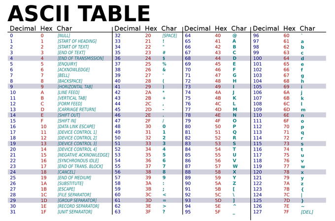

# final 키워드 
- final 키워드가 붙은 변수나 상수는 재대입이 불가능하다.
- 즉 변함없는 데이터를 사용하고 싶을 때 사용되는데,
- 변함없는 데이터라는 것을 알아볼 수 있기 쉽게 모두 대문자로 쓰며, snake 표기법을 사용한다.

```java
public class main {
    public static void main(String[] args) {
        final int VIP_POINT = 80;
        final int GOLD_POINT = 60;
        final int SILVER_POINT = 40;
        final int BRONZE_POINT = 20;
    }
}
```
---

# 자료형 변환 

- 변수의 자료형을 다른 자료형으로 변환하는 것을 의미한다. 
- 이때 변환되는 자료형은 변수가 담고 있는 값에 따라 결정된다. 
- 형 변환은 Up-Casting(암시적/묵시적)과 Down-Casting(명시적)이 있다.
- 자료형 변환에는 두 가지 방법이 있다.
  1. '(바꿀데이터타입)변수명'으로 작성한다.
  2. 새로운 변수를 선언하여 캐스팅이 이루어진 데이터를 집어넣는 방법.

## 정의
- 형 변환(Conversion)이란, 프로그램에서 서로 다른 자료형(Type) 간의 값을 주고 받을 때 발생하는
  데이터 표현 방식의 차이를 보정하기 위해 값을 적절히 변환하는 작업
- 예를 들어 32비트 정수(int) 값을 64비트(long) 변수에 담거나, 반대로 64비트 값을 32비트 변수에 담으려면
  반드시 변환 과정을 거쳐야만 함.

## 필요성
1. 메모리 최적화
  - 작은 타입에만 저장해도 충분한 값이라면, 더 큰 타입을 쓰는 것은 메모리 낭비이기 때문이다.
  - 반대로, 큰 범위의 값이 필요할 때 작은 타입으로만 프로그램을 자면 표현할 수 없는 값이 생긴다.
2. API 호환성
  - 예를 들어, 외부 라이브러리 메소드가 `long`을 받아들일 때, 우리 쪽에서 `int` 값을 넘기면 자동(묵시적)으로 `long' 변환이 필요하다.
3. 연산 정확도
  - 소수점 연산을 위해 `float → double`로 확장하거나, 반대로 저장 공간을 줄이기 위해 `double → float`으로 축소하는 사례가 많다.


## Up-Casting(업캐스팅)
: 더 큰 용량의 자료형으로 변환시키는 것.

```java
public class main {
    public static void main(String[] args) {
        // 1. Up-Casting(업캐스팅, 묵시적 변환)
        // 방법 1 : '(바꿀데이터타입)변수명'으로 작성한다.
        char cast1 = 'A';
        char cast2 = 'a';

        System.out.println("원형 : " + cast1);
        System.out.println("변형 : " + (int)cast1);

        System.out.println("원형 : " + cast2);
        System.out.println("변형 : " + (int)cast2);

        // 방법 2 : 새로운 변수를 선언하여 캐스팅이 이루어진 데이터를 집어넣는 방법.
        char cast3 = 'b';
        int cast3Number = cast3;

        System.out.println("변환 된 변수 : " + cast3Number);
    }
}
```

## Down-Casting(다운캐스팅)
:  더 큰 용량의 자료형을 작은 용량의 자료형으로 변환 시키는 것. 

```java
public class main {
    public static void main(String[] args) {
        // 2. Down-Casting(다운캐스팅, 명시적 변환) 
        int cast4 = 99;         // 방법 1 사용
        int cast5 = 100;        // 방법 2 사용

        char cast5Char = (char)cast5;

        System.out.println("원형 : " + cast4);
        System.out.println("변형 : " + (char)cast4);

        System.out.println("변환 된 변수 : " + cast5Char);
    }
}
```

## 자료형 크기 

| 타입     | 크기 (bits) | 부호 여부 | 표현 범위                                     | 비고                     |
|----------|-------------|-----------|-----------------------------------------------|------------------------|
| byte     | 8           | 있음      | -128 ~ 127                                    | 가장 작은 정수형, 최소 단위       |
| short    | 16          | 있음      | -32,768 ~ 32,767                              |                        |
| int      | 32          | 있음      | -2,147,483,648 ~ 2,147,483,647                | 기본 정수형                 |
| long     | 64          | 있음      | -9,223,372,036,854,775,808 ~ 9,223,372,036,854,775,807 | 큰 수를 다룰 때 사용           |
| float    | 32          | 있음      | ±1.4E-45 ~ ±3.4E+38 (약 7자리 정밀도)         | 단정도 부동소수점              |
| double   | 64          | 있음      | ±4.9E-324 ~ ±1.8E+308 (약 15자리 정밀도)      | 배정도 부동소수점 (기본 실수형)     |
| char     | 16          | 없음      | 0 ~ 65,535 (유니코드 문자)                    | 유니코드 문자 저장 용도          |
| boolean  | 1 (JVM 내부 처리) | 없음      | true 또는 false                               | 논리형, 크기는 명시적으로 정의되지 않음 |


## 유니코드


- 'A'와 'a' 정도는 기억해두면 좋다.

### 자료형 변환 시 주의사항
UpCasting의 경우, 메모리 용량이 커지기만 하면 되기 때문에,
기존의 데이터가 변형이 일어나지 않아 암시적/묵시적(imlicit)으로 변형이 가능하지만,

DownCasting의 경우, 데이터를 축소하는 과정에서 메모리 용량을 벗어나게 되는 경우가 있다.
용량 오버에 해당하는 현상을 미리 점검하기 위해 다운캐스팅 시에는 명시적(explicit)으로만 변형이 가능하다.

---

# 조건문(Condition)
## if문
### if문
: if 다음에 있는 () 내의 조건식이 true일 때 {} 내의 실행문이 실행된다. 즉, false면 실행되지 않는다.
: if 다음에 있는 () 내의 조건식이 true일 때 {} 내의 실행문이 실행된다. 즉, false면 실행되지 않는다.

```java
public class main {
    public static void main(String[] args) {
        /*
          if (조건식) {    // 조건식 : true / false로 결론이 날 수 있는 식 또는 문장
                실행문;
                실행문;
                ....
          } else if (조건식) {
                실행문;
                실행문;
                ...
          } else {
                실행문;
                ...
          }
         */
        // 변수 선언 및 초기화
        int num1 = 10;

        if(num1 > 0) {
            System.out.println("num1은 양수입니다.");
        } // true -> 실행 o

        if(num1 > 15) {
            System.out.println("num1은 15보다 작습니다.");
        } // false -> 실행 x
    }
}

```

### if-else문
: if 다음에 있는 조건식이 true일 때는 if문 내의 {}의 실행문이 실행되고,
false일 때는 else 내의 {}의 실행문이 실행된다.

```java
public class main {
    public static void main(String[] args) {
        /*
        if (조건식) {
            실행문;
            실행문;
            ...
        } else {
            실행문;
            ...
        }
         */
        int num1 = 0;

        if(num1 > 0) {
            System.out.println("num1은 양수입니다.");
        } else {
            System.out.println("num1은 음수이거나 0입니다.");
        }
    }
}

```

### if-else if-else문
: if - else문과 달리, else if에는 별도의 조건식이 요구된다. else if의 개수에는 제한이 없다.

```java
public class main {
    public static void main(String[] args) {
        Scanner scanner = new Scanner(System.in);
        int point = 0;
        final int VIP_POINT = 80;
        final int GOLD_POINT = 60;
        final int SILVER_POINT = 40;
        final int BRONZE_POINT = 20;
        
        System.out.print("회원 포인트를 입력하세요 >>> ");
        point = scanner.nextInt();

        if(point >= VIP_POINT) {
            System.out.println("회원 등급 : VIP");
        } else if (point >= GOLD_POINT) {
            System.out.println("회원 등급 : GOLD");
        } else if (point >= SILVER_POINT) {
            System.out.println("회원 등급 : SILVER");
        } else if (point > BRONZE_POINT) {
            System.out.println("회원 등급 : BRONZE");
        } else if (point <= BRONZE_POINT) {
            System.out.println("회원 등급 : NOMAL");
        } else {
            System.out.println("회원이 없습니다.");
        }
    }
}

```


### 삼항 연산자
- 조건식을 평가하여 true / false에 따라 두 가지 표현식 중 하나를 선택적으로 실행한다.
- 삼항 연산자 형식 
```
조건식 ? 표현식1 : 표현식2
```
- 조건식 : true / false로 평가 가능한 식.
- 표현식1 : 조건식이 true일 때 실행되는 코드.
- 표현식2 : 조건식이 false일 때 실행되는 코드.

1. 논리 연산자로 만든 윤년 계산기 
```java
public class main {
    public static void main(String[] args) {
        Scanner scanner = new Scanner(System.in);
        int year;
        String leapYear = "";

        System.out.print("연도를 입력하세요. >>> ");
        year = scanner.nextInt();

        if((year % 4 == 0 && year % 100 != 0) || year % 400 == 0) {
            if(year <= 0) {
                leapYear = "윤년이 아닙니다.";
            }

            leapYear = "윤년입니다.";
        } else {
            leapYear = "윤년이 아닙니다.";
        }

        System.out.println(year + "년도는 " + leapYear);
    }
}
```
2. 삼항 연산자로 만든 윤년 계산기 
```java
public class main {
    public static void main(String[] args) {
        Scanner scanner = new Scanner(System.in);
        int year;
        String leapYear = "";

        System.out.print("연도를 입력하세요. >>> ");
        year = scanner.nextInt();
        
        // 삼항 연산자를 이용한 윤년 계산기
        boolean isLeapYear;
        isLeapYear = (year % 4 == 0 && year % 100 != 0) || (year % 400 == 0);

        String result = year < 0 ? "불가능한 연도입니다."
                : isLeapYear ? "윤년입니다." : "평년입니다.";

        System.out.println(year + "년은 " + result);
    }
}
```
- 삼항 연산자를 사용 시, 코드를 좀 더 간결하게 작성할 수 있다는 장점을 가지고 있지만, 코드가 짧다고 해서 if문에 비해 속도가 빠르지는 않는다. 
- 또한, 축약된 형식이기 때문에 잘못 사용할 경우에는 소스 코드의 가독성을 해치기도 한다.  

## Switch문 
- if문과 비슷하지만, 좀 더 일정한 형식이 있는 조건/판단문이다. 
- switch문의 구조
```
switch(입력변수) {
    case 입력값1: ...
         break;
    case 입력값2: ...
         break;
    ...
    default: ...
         break;
}

```
- 입력 변수의 값과 일치하는 `case 입력값`이 잇다면, 해당 case 문의 속한 실행문들이 실행된다. 
- case문 마다 break라는 문장이 있는데, 해당 문장이 빠지면 그 다음의 case까지 실행하게 된다.
- default는 아무 조건식에 해당하지 않을 때 실행되며, 위의 실행문 중 하나가 실행되더라도 무조건 실행되는 부분이다.

```java
public class main {
  public static void main(String[] args) {
      
    Scanner scanner = new Scanner(System.in);

    System.out.print("점수를 입력하세요 >>> ");

    int score = scanner.nextInt();
    int changedScore = score / 10;
    String grade = "";

    if(changedScore < 0 || changedScore > 10) {
      grade = "x";
    } else {
      switch (changedScore) {
          case 10 :                 // switch의 특성으로 
        case 9 :                  // case10과 9는 같기 때문에 바로 10과 9는 모두 A로 나온다.
           grade = "A";
           break;
        case 8 :
          grade = "B";
          break;
        case 7 :
          grade = "C";
          break;
        case 6 :
          grade = "D";
          break;
        default :
          grade = "F";

      }
    }

    System.out.println("점수는 " + score + "점 이고, 학점은 " + grade + "입니다.");
  }
}
```
---

# 반복문

- 반복문은 코드를 반복적으로 실행하고자 할 때 사용한다.
- 반복문의 종류로는 for문과 while, do-while문이 있다. 
- for문과 while문은 서로 변환이 가능하기 때문에, 반복문을 작성할 때 어느 쪽을 선택해도 좋다. 
- 하지만 반복 횟수를 알고 있을 때는 for문, 조건에 따라 반복할 때는 while 문을 주로 사용한다. 

## while문
- 조건식이 true일 경우에 반복해서 사용한다. 
- while 문의 형식
```
while(조건식) {
    실행문;
    실행문;
    실행문;
}
```
- 조건식의 결과가 true일 때, {} 안의 실행문을 실행한다.
- 실행문이 끝나면, 다시 조건식을 통해 true와 false를 판단한다.
- true이면 실행문을 반복하여 실행하고, false이면 while문을 종료한다. 
- false가 되는 시점을 지정해주지 않는다면, 무한 반복이 되기 때문에
  무한 루프(infinite loops)라는 표현을 쓰며, 무한 루프에 빠지지 않도록 조심해야 한다.

```java
public class main {
  public static void main(String[] args) {
    int i = 0;
    
    while (i < 100) {
        i++;
        System.out.println(i);
    }
  }
}
```
- while문 역시 중복이 가능하다. 
```java
public class main {
  public static void main(String[] args) {
    /*
         중첩 while을 이용하여 구구단을 만들어라.
     */

    int fristNum = 2;

    while(fristNum < 10) {
      int secondNum = 1;
      while(secondNum < 10) {
        System.out.println(fristNum + "*" + secondNum + "=" + (fristNum * secondNum));
        secondNum++;
      }
      System.out.println();
      fristNum++;
    }
  }
}
```
- while문 예시
```java
public class main {
  public static void main(String[] args) {
    /*
            while문을 이용하여,.

            1 2 3 4 5 6 7 8 9 10
            11 12 13 14 15 16 17 18 19 20
            ...
            91 92 93 94 95 96 97 98 99 100
            출력되도록 작성하시오.
         */

    int i = 0;
    // 반복을 100번 하는 경우
    while (i < 100) {
      i++;
      System.out.print(i + " ");
      if(i % 10 == 0) {
        System.out.println();
      }
    }

    System.out.println();

    int j = 1;
    // 반복을 10번 하는 경우 
    while(j < 101) {
      System.out.println(j + " " + (j + 1) + " " + (j + 2) + " " + (j + 3) + " " + (j + 4) + " "
              + (j + 5) + " " + (j + 6) + " " + (j + 7) + " " + (j + 8) + " " + (j + 9) + " ");
      j += 10;
    }
  }
}
```

## for문 
- for문은 조건식이 참인 동안, 주어진 횟수만큼 실행문을 반복적으로 실행한다.
- 주로 반복문을 초기화 할 때, 반복 계수 i(iteratio)를 사용한다. 
- for문의 구조 
```
for (초기화 ; 조건식 ; 증감식) {
    실행문;
} 
```
- 초기화 : for문이 시작될 수를 정하는 것으로, 반복할 변수의 초깃값을 설정한다.
- 조건식 : 반복할지의 여부를 결정하는 곳이며, 조건식의 안의 값이 true라면 실행문을 실행하고 false라면 반복문을 벗어난다.
- 증감식 : 반복 횟수를 결정하는 곳이다. 변수에 더하거나, 빼거나, 곱하는 등 수행 방식을 설정한다. 


```java
public class main {
  public static void main(String[] args) {
    // 1부터 100까지 중 홀수 합을 구하는 for문을 작성하시오.

    int sum1 = 0;

    for (int i = 0; i < 101; i++) {
      if(i % 2 == 1) {
        sum1 += i;
      }
    }

    System.out.println(sum1);

    int sum2 = 0;
    for (int i = 1; i < 101; i+=2) {
      sum2 += i;
    }

    System.out.println(sum2);
  }
}
```
```java
public class main {
  public static void main(String[] args) {
    // for문을 사용하여 구구단을 구현하라.

    for (int i = 2; i < 10; i++) {
      for(int j = 1; j < 10; j++) {
        System.out.println(i + " * " + j + " = " + (i * j));
      }
    }
  }
}
```
```java
public class main {
  public static void main(String[] args) {
    // 1일차 1교시입니다. ~ 5일차 3교시입니다.
    for (int i = 1; i < 6 ; i++) {
      for (int j = 1; j < 4; j++) {
        System.out.println(i + "일차 " + j + "교시 입니다.");
      }
    }

    // for문 내에서 선언된 변수는 for문의 중괄호{} 내에서만 사용이 가능하다.
    // 외부의 같은 변수명이 있을 수 있음.
  }
}
```
```java
public class main {
  public static void main(String[] args) {
    // for 문으로 별찍기
    for(int i = 0; i < 5; i++) {
      for(int j = 0; j <= i; j++) {
        System.out.print("*");
      }
      System.out.println();
    }

    System.out.println();

    // 거꾸로 별 찍기
    for(int i = 5; i > 0; i--) {
      for(int j = i; j > 0; j--) {
        System.out.print("*");
      }
      System.out.println();
    }

    System.out.println();

    Scanner scanner = new Scanner(System.in);

    System.out.print("찍고 싶의 개수는? >>> ");
    int starNum = scanner.nextInt();

    for(int i = 0; i<starNum; i++) {
      for(int j = 0; j <= i; j++) {
        System.out.print("*");
      }
      System.out.println();
    }
  }
}
```