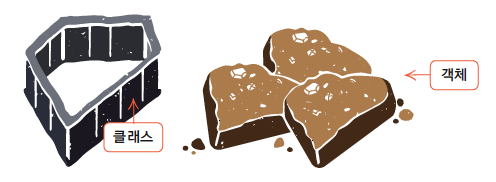

# Method
: JAVA에서 클래스는 멤버(member)로 속성을 표현하는 필드(field)의 기능을 표현하는 메소드를 가진다.

- 그 중에서 메소드란, 어떠한 특정 작업을 수행하기 위한 명령문의 집합이라고 할 수 있다. 
- 즉, 메소드는 클래스 내에 정의가 되며, 특정 작업을 위해 수행되는 코드블록.
  - 코드를 재사용하고 유지보수를 용이하게 하기 위함.
  - 객체의 행동을 정의하기 위함.
  - 프로그램 구조를 논리적으로 나누기 위함.
- JAVA에서 함수(Function)는 존재하지 않고, 전부 다 method에 속함
- 함수와 클래스는? 일련의 동작을 묶어서 정의한 것. 입력값과 출력값이 존재한다.(optional)
- 그렇다면 함수와 method는 동일한 정의를 가지고 있는 것이라고 한다면, 왜 용어를 분리하는가?
  - 클래스 내부에 함수를 정의를 하게 되면 이를 메소드라고 한다.
  - JAVA의 경우 모든 함수들이 특정 클레스에 종속되어 있기 때문에 전부 다 method에 해당한다.
  - 즉 다른 언어(Pyton, JS, etc ..)를 배우게 된다면 함수의 호출 방식과 메소드의 호출 방식 상에서의 차이가 있기 때문에 용어를 메소드라고 통일하는 것이 낫다. 
- 메소드 호출 형식
```
1. 클래스명.메소드명()
2. 객체명.메소드명() : scanner.nextInt();
3. 메소드명()
```
```java
import java.util.Scanner;

// 예시
Scanner scanner = new Scanner(System.in);
int number = scanner.nextInt(); 
```
- 메소드 정의의 의미 : 특정한 메소드를 클래스 내에 만드는 것으로, 즉 사용자 정의 메소드를 의미한다. 
- 사용 목적은 다음과 같다.
  1. 중복되는 코드의 반복적인 프로그램잉을 피할 수 있기 때문.
  2. 모듈화로 인해 코드의 가동성도 좋아진다.
  3. 프로그램에 문제가 발생하거나 기능의 변경이 필요할 때도 손쉽게 유지보수를 할 수 있다. 

- 예 : 특정 작업을 수행하기 위해 사용되는 코드 블록
  - 비유적으로 설명하자면
    - '사진을 찍는다'라는 행위를 생각해보면,
      1. 주머니에서 핸드폰을 꺼내고
      2. 잠금화면을 풀고
      3. 카메라를 켜고
      4. 사진을 찍고자 하는 대상에 폰을 조준하고,
      5. 세터를 누른다.
    - 라는 일련의 과정을 거친다. 즉 사진을 한 번만 찍기 위해서는 1-5가 순서대로 입력되어야 한다는 점이다.
    - 컴퓨터는 사람의 말을 알아듣기 힘들기 하나씩 순서대로 명령해줄 필요가 있는데, '애초에' '사진을 찍느다.'라는 메소드를 '호출한다면'
      1~5까지의 명령어를 미리 입력(정의) 해주고, 필요할 때마다 '사진을 찍는다'는 메소드 '호출'을 한다면 자동으로 1-5를 순차적으로 실행시키게 된다.
    - 이를 `코드 블록`이라는 표현을 쓴다.

- 함수 / 메소드 관련 용어 정리
  1. 메소드 정의(define) : 사용자가 메소드를 새로 만드는 것을 의미
  2. 인수(argument) : 사용자가 메소드를 새로 만드는 것을 의미힌디.
  3. 매개변수(parameter) : 인수를 받아서 전달할 입력(input)
  4. 변환값/출략값/리턴값(return) - 만들어진(혹은 미리 만들어진 .nextInt()등) 메소드를 실제로 사용한다.
  5. 메소드(Method) : Java에서 클래스의 멤버 중 하나로 기능을 표현한다. 

- 메소드는 입출력 유무에 따라 다음과 같이 4가지로 분류 할 수 있다. 
  1. 입력과 출력이 모두 있는 메소드
  2. 입력과 출력이 모두 없는 메소드
  3. 입력은 없고 출력은 있는 메소드
  4. 입력은 있고 출력은 없는 메소드 

- 내부에 변수를 대입하고 값을 돌려받는 메소드이다. 
```java
public class main {
    int sum(int a, int b) {  // a, b 는 매개변수
        return a+b;
    }
}
```
- 내부의 변수를 리턴해주는 입력 값이 없는 메소드이다.
```java
public String getName() {
    return this.name;
}
```
- 내부의 변수에 대입하기 위한 메소드로서, 반환 값이 없는 메소드이다.
```java
public void setName(String name) {
     this.name = name;
}

```
- 내부의 변수에 대입하고 결과를 출력하는 메소드이다. 
```java
public class main {
    void sum(int a, int b) {
        System.out.println(a+"과 "+b+"의 합은 "+(a+b)+"입니다.");
    }
}
```
- 내부의 값을 출력을 하는 메소드이다. 
```java
public class main {
    String say() {
        return "Hi";
    }
}
```

## 메소드 선언


### 접근제한자 
: 해당 메소드에 접근할 수 있는 범위를 명시한다. 

- public : 외부 클래스에서 자유롭게 사용가능하다.
- protected : 같은 패키지 또는 자식 클래스에서 사용할 수 있다.
- private : 외부에서 사용할 수 없으며, 같은 클래스 내부에서만 사용이 가능하다.
- default : 같은 패키지에 소속된 클래스에서만 사용이 가능하다. 

### 리턴타입(반환타입)
: 메소드가 모든 작업을 마치고 반환하는 결과의 데이터 타입을 명시한다.

- 외부에서 메소드를 호출하면 메소드는 외부에서 값을 입력받아 매개변수에 저장하고, 구현부에서 실행하여 리턴값을 다시 돌려주는 역할을 한다. 
즉, 반환타입은 메소드를 실행한 후의 결과값 타입이다. 

- 결과값이 없는 경우도 있는데, 해당 경우에는 `void`를 사용한다.
- 반환 타입에 void 타입이라 작성하는 경우, 구현부에 return이 생략된 상태로 존재하며 메소드 내부의 코드를 실행만 하는 메소드이다.
- 리턴 값이 있는 경우에는 반드시 리턴 타입을 선언부에 명시해야 하며, 이때 반환 값과 반환 타입은 반드시 같아야 한다.

### 메소드명
: 메소드의 기능이 드러나도록 식별자의 규칙에 맞게 이름을 작성해야 한다.

- 메소드명은 동사로 한다.
- 클래스명과 마찬가지로 여러 개의 단어가 섞이는 경우, 각 단어의 첫 번째 문자는 대문자로 한다.
- 단, 처음 시작하는 문자는 항상 소문자로 시작한다. 

### 매개변수(Parameter) 
: 메소드 호출 시에 전달되는 인수의 값을 저장할 변수를 명시한다. 

- 매개변수는 지역변수라고도 한다. 
- 매개변수는 메소드 수행에 필요한 입력 값을 저장하는 변수이다. 

### 인수(Argument) 
: 메소드를 호출할 때 전달하는 값을 의미한다. 

### 구현부
: 메소드의 고유 기능을 수행하는 명령문의 집합으로, 실행할 코드를 작성하는 공간이다. 

## 메소드 호출
```java
public class main{
    // 1. [ x | x ] [ 입력값 / 출력값 ]
    public static void call1() {
        System.out.println("[ x | x ]");
    }

    // 2. [ o | x ]
    public static void call2(String strExample) {
        System.out.println("[ o | x ]");
        System.out.println("오늘의 다짐 : " + strExample);
    }

    // 3. [ x | o ]
    public static String call3() {
        System.out.println("[ x | o ]");
        String result = "";                 // 지역 변수 - 메서드 내에 정의된 변수
        for( int i = 0 ; i < 3 ; i++ ) {
            for (int j = 0 ; j < i + 1 ; j++) {
                result += "🎁";
            }
            result += "\n"; // \n - 개행하라는 의미 \t -> 공백 두번 / 네번
        }
        return result;
    }

    // 4. [ o | o ]
    public static String call4(int year, int month, int date, String day) {
        System.out.println("[ o | o ]");
        return year + "년 " + month + "월 " + date + "일 " + day + "입니다. 😂 힘내요" ;
    }

    public static void main(String[] args) {
        // method를 실행하는 영역
        call1();
        call2("메소드 call2() 호출");
        System.out.println(call3());

        System.out.println(call4(2025, 4, 24, "목요일"));
    }
}
```


### 함수형 프로그래밍(Funtional Programming)
메소드1의 return 값이 메소드2의 argument가 되고,
메소드2의 return 값이 메소드3의 argument가 되는 방식으로,
첫 번째 메소드로부터 마지막 메소드까지의 흐름을 통해 프로그램이 이어지는 방식을 의미한다.


아래 코드는 main에서 registerStudent2()라는 메소드로 학생의 수를 입력 받은 후,
다시 registerStudent()라는 메소드에서 학번과 이름을 받아서 출력하는 함수이다. 이와 같이 연결하여 사용이 가능하다. 
```java
public class main {
    public static void registerStudent() {
        Scanner scanner = new Scanner(System.in);

        System.out.print("학번을 입력하세요. >>> ");
        int studentNum = scanner.nextInt();
        System.out.print("이름을 입력하세요. >>> ");
        String studentName = scanner.next();

        System.out.println("학번 : " + studentNum);
        System.out.println("이름 : " + studentName);
    }

    public static void registerStudent2(int student) {
        for(int i=0; i<student; i++) {
            registerStudent();          // 코드의 재사용성의 예시 
        }
    }

    public static void main(String[] args) {

        Scanner scanner = new Scanner(System.in);

        System.out.print("몇 명의 학생을 등록하시겠습니까? >>> ");
        int studentAll = scanner.nextInt();

        registerStudent2(studentAll);
    }
}
```

---
# 클래스(Class)
- Java에서 클래스란, `객체`를 만들어 내기 위한 설계도 또는 틀과 같은 의미로 사용된다.
- 클래스 모양 그대로 생성된 실체를 객체라고 한다. 
- 현실 세계의 개념을 프로그래밍으로 표현할 때, "특정 사물이나 개념의 특징(속성)"과 "행위(메소드)"로 정의함.
- 예를 들어, "자동차"라는 클래스를 만든다면 자동차 속성(색상, 도구)과 행위(동작, 정지 등)를 코드로 표현 할 수 있음. 

## 클래스 관련 용어 정리
1. 멤버 변수(Member Variable) 
  - 클래스 안에 선언된 변수(Varialbe) 중 `인스턴스 변수` 나 `클래스(static) 변수`를 모두 포함하는 가장 포괄적인 개념. 
  - 클래스의 "구성원"들이 가지는 변수라는 의미로 Member Variable라고 한다. 
  - 즉, 클래스 내에서 사용되는 변수로 클래스의 속성을 나타냄. 
```java
public class People {
    int age;
    String name;
}
```
2. 속성(Attribute) 
  - 객체가 가지는 `상태(Status)`를 설명할 때 사용하는 용어.
  - 주로 객채의 상태 또는 특징을 설명할 때 사용한다.
  - 실질적으로 멤버 변수와 같은 의미이지만, 개념적으로는 `특정 객체의 특징이나 성질`을 나타낸다. 
```java
public static void main(String[] args) {
  People p = new People();
  p.age = 25;
  p.name = "김일"
}
```
3. 필드(Field)
  - Java 언어 명세 공식 문서에서 주로 클래스 내에서 직접 선언된 변수를 필드라고 칭한다. 즉, 메소드 안이 아닌 클래스 블록 안에 선언된 변수를 의미한다.
  - 메소드 외부, 클래스 내부에서 선언된 변수.
  - static과 관계 없다.
  - Java 언어에서 공식적으로 사용을 권장하는 용어이다. 
```java
public class People {
    private String name;
    private int age;
    
    public getAge() {
        return this.age;
    }
}
```
  - 객체 내에 값을 저장할 멤버 변수를 필드라고 부른다.
  - 클래스 내에서 선언된 위치에 따라 클래스 변수(static variable), 인스턴스변수(instance variable), 지역 변수(local variable)로 구분된다.


## 객체의 정의 
- 클래스를 설계도로 가정했을 때, 실제 사용할 수 있는 자동차(인스턴스)는 객체라고 한다.
- 객체(Object)와 인스턴스(Instance)라는 표현이 혼용되어 사용되며, 한국에서는 거의 구분 하지 않는다. 

### 객체 vs 인스턴스 
- 객체는 포괄적인 개념으로 클래스에서 생성된 모든 것을 객체라고 표현한다. 
- 인스턴스는 특정 객체가 어떤 클래스의 구현체인지 강조하는 표현이다.
- 비유하자면, 다음과 같다. 

  - 클래스 : 설계도, 틀
  - 객체 : 클래스를 바탕으로 만들어진 모든 실물
  - 인스턴스 : `특정` 설계도를 기반으로 만들어진 `해당 실물`


1. 클래스(Class): 객체를 만들기 위한 설계도(Blueprint)를 말합니다. 클래스는 객체를 생성하기 위한 `속성(Field)`과 `메소드(Method)`를 정의합니다.
2. 객체(Object): 속성과 동작을 가지는 실체(Entity)를 말합니다. 객체는 클래스의 인스턴스(Instance)이며, 자신만의 상태(State)와 행동(Behavior)을 가집니다.
3. 인스턴스(Instance): 클래스를 기반으로 생성된 객체를 말합니다. 클래스에서 생성된 각각의 인스턴스는 고유한 상태(State)와 행동(Behavior)을 가지며, 객체의 특징을 표현합니다.

- _자바에서 객체(Object)와 인스턴스(Instance)는 서로 연관된 개념이다. 객체는 <클래스의 인스턴스>라고도 표현할 수 있다. 객체는 클래스에서 정의된 속성과 메서드를 가지며, 인스턴스는 클래스로부터 생성된 객체를 의미한다.
즉, 객체는 클래스에 대한 추상적인 개념을 나타내며, 인스턴스는 클래스로부터 생성된 구체적인 개념을 나타낸다._
- _객체는 클래스에서 정의된 속성과 메서드를 가지는 실체를 의미하며, 인스턴스는 클래스로부터 생성된 객체를 나타낸다._

클래스는 추상적인 개념이며, 객체와 인스턴스는 구체적인 개념이다. 

### 인스턴스(Instance)
- 클래스로부터 객체를 선언하는 과정을 클래스의 인스턴스화라고 한다.
- 자바에서는 하나의 클래스로부터 여러 개의 인스턴스를 생성할 수 있다. 

### 생성자
- 클래스의 이름과 동일한 메소드를 생성자라고 한다.
- 생성자가 객체가 생성될 때, 자동으로 호출되는 특별한 메소드이다.
- 즉, 자바에서 객체의 생성과 동시에 인스턴스 변수를 원하는 값으로 초기화 할 수 있는 메소드 생성자라고 한다.

## 객체 생성 


```
클래스명 객체명 = new 클래스명();
```

```java
public class Animal {
    int age;
    String name;
    String color;
}
```

```java
public class main {
  public static void main(String[] args) {
    Animal animal = new Animal();
  }
}
```

Car Class 생성

색상(빨강, 노랑, etc), 속도(100.200, etc) 필드를 정의하고
drive() / break() / displayCarInfo() 메소드를 정의하라.

        1. drive() 결과값
            : 빨강 자동차가 주행 중입니다.
            : 최고 속도는 100 입니다.
        2. brake() 결과값
            : 빨강 자동차가 멈췄습니다.
        3. displayCarInfo() 결과값
            : 이 차의 색깔은 빨강색이고,
            : 최고 속도는 100km/h입니다.

            : 아 처우ㅏ 색깔은 노랑색이고
            : 최고 속도는 200km/h입니다.
            // 100이하면 보통, 100초과면 빠름.

        다 작성한 뒤, car 1의 색상은 빨강, 속도는 100으로 생성
        car2의 색상은 노랑, 속도는 200으로 실행한 후
        각각 drive(), brake(), displayCarInfo() 실행하고
        콘솔창에 결과를 출력하시오.

```java
public class Car {
    
    String color;
    int speed;

    public void drive() {
        System.out.println(color + " 자동차가 주행중입니다. \n"
                            + "최고 속도는 " + speed + "Km/h 입니다.");
    }

    public String brake() {
        return color + " 자동차가 멈췄습니다.";
    }

    public void displayCarInfo() {
        System.out.println("이 차의 색상은 " + color + " 이고, \n"
                        + "최고 속도는 " + speed + "입니다. " + ((speed > 100 ? "빠릅니다." : "보통입니다.")));

    }
}
```

```java
public class CarMain {
  public static void main(String[] args) {
    Car car1 = new Car();
    Car car2 = new Car();

    car1.color = "빨강";
    car1.speed = 100;

    car2.color = "노랑";
    car2.speed = 200;

    car1.drive();
    car2.drive();

    System.out.println();

    System.out.println(car1.brake());
    System.out.println(car2.brake());

    System.out.println();

    car1.displayCarInfo();
    car2.displayCarInfo();
  }
}
```