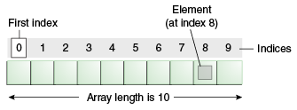

# 배열(Array)


- `배열`이란, 고정된 개수의 단일 타입 값들을 담는 객체이다. 즉 '같은' 자료형의 데이터를 하나의 변수에 저장해서 처리하는 방식이라고 할 수 있다.
- 이때, 배열에 들어 있는 변수들을 배열의 요소(components, 컴포넌트)라고 한다.
- 한 배열의 모든 요소들은 같은 타입을 갖는데, 그 타입을 _배열 요소의 타입(component type)_ 이라고 한다.
- 배열의 element type은 아무 타입이나 가능하다.
    - 기본형(primtive)과 참조형(reference) 타입 모두 가능하다.
    - 예를 들어, interface 타입니다 class 타입도 배열의 요소가 가능하다는 의미이다.

1. `요소(element)` : 배열의 각 저장공간
2. `인덱스(index)` : 배열의 요소마다 붙여진 일련 번호 또는 주소

## 배열의 길이와 인덱스
- 변수를 사용할 때는 변수의 이름을 통해서 변수에 접근한다.
- 그러나 배열에 들어 있는 변수에는 이름이 없으며, 대신 음수가 아닌 정수 인덱스 값에 의해 참조된다.
- 만약, 배열에 n개의 요소가 있다고 한다면, 각 요소는 0에서 n-1까지의 정수 인덱스를 사용하여 참조된다.
- 또한 배열에 n개의 요소가 있다면 n의 배열의 길이라고 한다. 배열의 길이는 배열이 생성될 때 정해지며, 배열이 생성된 이후에 배열의 길이는 고정된다.
- 만약 배열의 길이가 0이라고 한다면, 해당 경우를 비었다(empty)라고 한다.

## 배열 변수 (Array Variables)

- 배열 타입 변수는 배열 객체를 참조하는 변수이다. 배열 객체와 배열 타입 변수(Array Variables)는 다른 것이다.
- 배열 타입 변수는 배열 객체의 주소를 저장하는 참조형 변수이다. 따라서 배열 타입 변수를 선언하는 것은 배열 객체를 생성하거나 배열 요소를 위한 공간을 할당하지 않는다.
- 오직 배열을 담을 수 있는 배열을 다룰 수 있는 변수 그 자체를 만든다.


```java
// 자료형[] 변수명;
int[] arr1;
char[] arr2;
byte[][] arr3;
String[] arr4;
```
```dtd
자료형[] 배열명;      // 1차원 배열
자료형[][] 배열명;    // 2차원 배열

// n차열 배열은 대괄호 쌍 n개([][] ... )로 작성
```

## 배열 생성 
- 배열 객체는 array creation expression 또는 array initializer를 통해 생성할 수 있다.

1. Array Creation Expression을 이용한 배열 객체 생성 
```java
int[] arrInt = new int[5]
```
- 해당 방법을 이용해서 배열 객체를 생성하면 객체의 각 요소는 요소 타입(component type)의 기본값(default value)으로 초기화 되고 객체의 길이는 사용자가 설정한 값이 된다. 

2. Array Intializer를 이용한 방법
```java
int[] arrInt = {1, 2, 3, 4, 5};
```
- 해당 방법을 이용해서 생성된 객체의 길이는 중괄호 {} 안에 있는 값들의 개수와 같고,
- 객체의 요소는 주어진 값으로 초기화 된다. 

3. 배열 변수가 선언되고 배열 객체가 생성되는 과정 
```java
int[] arr;
arr = new int[5];
```
위 코드를 바탕으로 배열 객체가 생성되는 과정을 알아보자.
```java
int[] arr;
```
- 위와 같이 int형 배열 참조 변수 arr를 선언을 한다.
- 배열 객체는 생성되지 않으므로 아래와 같은 형태로 생성된다.


```java
arr = new int[5]
```
- 연산자 new에 의해서 메모리의 빈 공간에 5개의 int형 데이터를 저장할 수 있는 공간이 마련된다. 
- 예를 들어, 배열이 생성된 메모리 주소가 0x200이라고 가정했을 때

- 그리고 각 배열 요소는 자동적으로 int의 기본값인 0으로 초기화 된다. 

- 끝으로 대입 연산자 `=`에 의해 배열의 주소가 int형 배열 참조 변수 arr에 저장된다. 


## 배열 접근
- 배열의 요소들은 인덱스와 대괄호[]를 이용하여 접근할 수 있다. 
```java
int[] arr = new int[10];
System.out.println(arr[0]);
```
- 모든 배열의 인덱스는 0부터 시작한다.
- 만약 배열의 길이가 n이라면, 해당 배열의 인덱스는 0부터 n-1까지의 정수로 이루어져 있다.
- 배열은 반드시 int 값으로 인덱싱이 되어야 한다. 
- 0보다 작거나 배열의 길이 이상의 인덱스를 사용해서 배열에 접근하면 _ArrayIndexOutOfBoundsException_ 에러가 발생한다. 
- 배열의 인덱스에 들어가는 값은 실행 시에 대입된다.

## 배열 초기화
- 배열은 생성과 동시에 자동적으로 자신의 타입에 해당하는 기본값으로 초기화되므로 사용하기 전에 따로 초기화를 해주지 않아도 된다.
- 하지만 원하는 값을 넣기 위해서는 따로 각 요소마다 값을 지정해주어야 한다.

```java
int[] arr = new int[5];
arr[0] = 10;
arr[1] = 20;
arr[2] = 30;
arr[3] = 40;
arr[4] = 50;
```

- 위와 같이 직접 하나씩 값을 지정할 수도 있지만, 배열의 크기가 큰 경우에는 for문을 사용할 수도 있다. 
- for문으로 배열을 초기화 하는 경우는 일정한 규칙이 있는 값을 저장할 때만 가능하다.
```java
int[] arr = new int[100];
for(int i = 0; i < arr.length; i++) {
    arr[i] = i;
}
```
- 일정한 규칙이 없을 때에는 다음과 같이 간단하게 배열을 초기화 할 수 있는 방법이 있다.
```java
int[] arr = new int[] {50, 60, 70, 80, 90}; // 배열의 생성과 초기화를 동시에 진행
int[] arr = {50, 60, 70, 80, 90}; // new int[]를 생략할 수도 있다.
```

- 저장할 값들을 중괗로 {} 안에 쉼표로 구분하여 나열하면 되고, 괄호 {} 안의 값의 개수에 의해 배열의 길이가 자동으로 결정되기 때문에 괄호[] 안에 배열의 길이를 적지 않아도 된다. 
- 그러나 배열 선언과 생성을 따로 하는 경우에는 new int[]를 생략 할 수 없다.
```java
int[] arr;
arr = new int[] {50, 60, 70, 80, 90};
```