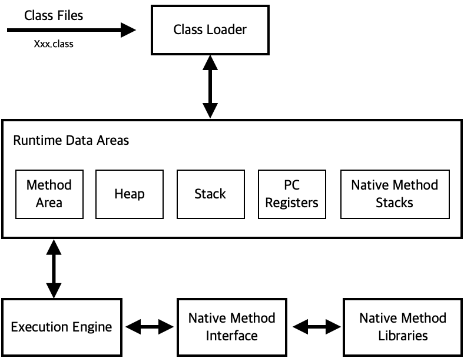
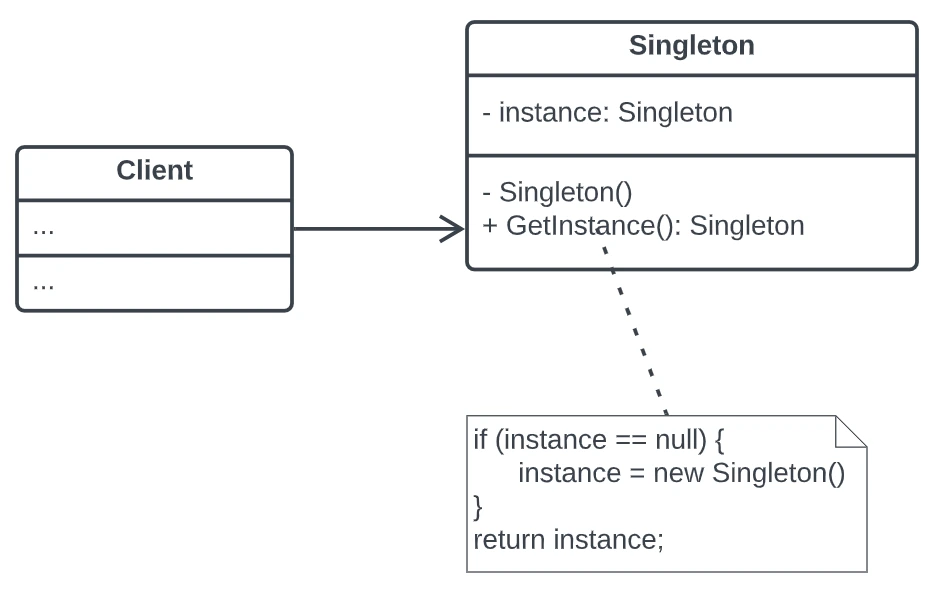

# 최상위 클래스(Object Class)
모든 클래스의 최상위 클래스이다. 
- 모든 클래스는 최상위 클래스를 상속 받는다. 
- 컴파일러는 자동으로 `extends Object`를 추가한다. 
```
class Student → class Student extends Object
```
- Object Class는 java.lang 패키지 내에 존재하며, java.lang 패키지는 프로그래밍 시 import 하지 않아도 자동으로 import 된다.
```java
import java.lang.*;
```

_모든 클래스는 Object에 상속받고, Object 클래스의 메소드 중 일부는 재정의해서 사용할 수 있다._

## toString()
객체의 정보를 String으로 바꾸어 사용할 때 쓰이는 메소드.

## equals()
두 인스턴스의 주소 값을 비교하여 true/false 값을 반환한다.

(여기서 주소 값이라고 하면, heap 영역의 물리적 주소를 말한다.)

- equals() 메소드는 사용자가 재정의하여 두 인스턴스가 논리적으로 동일함의 여부를 구현할 수 있다. 
- 즉 인스턴스가 다르더라도 논리적으로 동일한 경우 true를 반환하도록 재정의를 할 수 있다.

## hashCode()
인스턴스의 저장 주소를 반환하도록 하는 메소드이다. 

- 힙 메모리에 인스턴스가 저장되는 방식이 hash 방식이기에 다음과 같은 이름이 생겼다. 
- 즉, 자료의 특정 값(키 값)에 대한 저장 위치를 반환해주는 해시 함수를 사용한다. 

```java
public class Teacher {
    private String name;
    private String schoolName;

    public Teacher(String name, String schoolName) {
        this.name = name;
        this.schoolName = schoolName;
    }

    public String getName() {
        return name;
    }

    public void setName(String name) {
        this.name = name;
    }

    public String getSchoolName() {
        return schoolName;
    }

    public void setSchoolName(String schoolName) {
        this.schoolName = schoolName;
    }

    @Override
    public String toString() {
        return name + "선생님의 근무지는 " + schoolName + "입니다.";
    }

    @Override
    public boolean equals(Object o) {
        if (o == null || getClass() != o.getClass()) return false;
        Teacher teacher = (Teacher) o;
        return Objects.equals(name, teacher.name) && Objects.equals(schoolName, teacher.schoolName);
    }

    @Override
    public int hashCode() {
        return Objects.hash(name, schoolName);
    }
}
```

---
# Lombok

## 정의
Java에서 반복적으로 작성해야하는 코드(boilerplate code)를 자동으로 생성해주는 라이브러리 

## 장점
1. 코드의 가독성을 높일 수 있다.
    - 주석을 통한 애너테이션(@)을 붙여서 코드 생성을 제어 가능하다. 특히 스크롤링해서 특정 필드가 setter/getter가 있는지 찾아볼 필요없이 @Getter가 있으면 getter가 있는 것이고 @ToString이 있으면 toString() 메소드가 있는 식으로 곧장 확인이 가능하다는 장점이 있다. 
2. 어노테이션을 통한 코드 자동 생성을 통해 생산성, 편의성 증가
3. Builder 패턴의 적용, Log 생성 등등 편의성 

## 종류
1. @DATA
    - @Getter(모든속성), @Setter(final이 붙지 않은), @ToString,
      @EqualsAndHashCode, @RequiredArgsConstructor
      위의 어노테이션들을 합쳐둔 어노테이션이다.
2. @NoArgsConstructor
   - 파라미터(매개변수)가 없는 생성자를 생성한다.
3. @RequiredArgsConstructor 
   - final, @NonNull이 있는 필드를 포함하여 생성자를 생성한다.
4. @EqualAndHashCode
    - equals() / hashCode() 메소드를 자동 생성
5. @ToString 
    - toString() 메소드를 자동 생성
    - 객체의 필드 값을 문자열로 표현해주는 메소드(객체명만으로 호출 가능)
6. @AllArgsConstructor
    - 모든 필드를 포함하는 매개변수 생성자를 생성
    - @Data 안에 포함 되어 있지 않다는 것을 주의 해야 함.
7. @Getter / @Setter
    - code가 컴파일 될 때 getter, setter 메서드들을 생성한다.
    - 속성 @Getter(lazy = true) 사용 시, 최초 한번만 Getter 호출. 이후 캐시된 값을 사용
8. @Builder
    - 	해당 클래스에 빌더 패턴을 사용할 수 있도록 해준다.

## lobok 라이브러리 설치 과정
1. 상단 메뉴바 -> 설정 -> 플러그인 클릭
2. lombok 검색
3. lombok 설치 후 활성화

## 의존성 주입(Dependency Injection)
1. 구글에서 mvn 검색
2. https://mvnrepository.com/ 접속
3. lombok 검색 후 1번의 Project Lombok을 선택
4. 빌드에 맞는 것을 찾아 넣지만, 이번에는 `dependencies`를 활용한다.
5. 1.18.38을 누른 후, Maven의 dependency 코드를 복사한다.
6. 다음과 같이 pom.xml에 코드를 추가한다.
```xml
<?xml version="1.0" encoding="UTF-8"?>
<project xmlns="http://maven.apache.org/POM/4.0.0"
         xmlns:xsi="http://www.w3.org/2001/XMLSchema-instance"
         xsi:schemaLocation="http://maven.apache.org/POM/4.0.0 http://maven.apache.org/xsd/maven-4.0.0.xsd">
    <modelVersion>4.0.0</modelVersion>

    <groupId>org.example</groupId>
    <artifactId>java_practice</artifactId>
    <version>1.0-SNAPSHOT</version>

    <dependencies>
        <dependency>
            <groupId>org.projectlombok</groupId>
            <artifactId>lombok</artifactId>
            <version>1.18.38</version>
            <scope>provided</scope>
        </dependency>
    </dependencies>

    <properties>
        <maven.compiler.source>17</maven.compiler.source>
        <maven.compiler.target>17</maven.compiler.target>
        <project.build.sourceEncoding>UTF-8</project.build.sourceEncoding>
    </properties>

</project>
```

## 설치 검증 
클래스 위에 @Setter나 @Getter 등 사용했을 때, 안 될 경우 잘못 설치 된 것. 

---

# Static
static이란 '정적인', '고정적인'이라는 사전적 의미를 가진다. 

이를 java 관점으로 해석하면 '클래스의' 또는 '공통적인'이라는 의미를 가진다. 

static을 이해하기 위해서는 JVM(자바 가상 머신)을 이해 할 필요가 있다.



1. java 애플리케이션을 실행하면 JVM 은 OS 로부터 메모리를 할당한다.
2. 자바 컴파일러 (javac) 가 자바 소스코드 (Xxx.java) 를 바이트코드 (Xxx.class) 로 컴파
3. 
4. 일 한다.
3. 클래스 로더 (Class Loader) 를 통해 JVM 메모리 (Runtime Data Areas) 로 로딩한다.
4. 로드된 클래스 파일 (Xxx.class) 들은 기계가 읽을 수 없으므로 실행 엔진 (Execution Engine) 을 통해 기계어로 변환하여 실행한다.
5. 이 과정에서 실행엔진에 의해 가비지 콜렉터 (Garbage Collector) 등도 작동된다.

자바 어플리케이션이 실행되면 JVM은 시스템으로부터 필요한 메모리를 할당받고, 용도에따라 여러 영역으로 나누어 관리한다. Method Area, Call Stack, Heap 이 대표적이다.

- 클래스에서 공유되는 변수나 메서드를 정의할 때 사용된다.
- 클래스 자체에 속하지 않는다.
- 이는 인스턴스를 생성하지 않고 접근이 가능하다는 점에서 인스턴스 변수, 메소드와 구분이 된다. 
- `Static`이라는 키워드를 사용하여 Static변수와 Static메소드를 만들 수 있는데 다른말로 정적필드와 정적 메소드라고도 하며 이 둘을 합쳐 정적 멤버라고 한다. (클래스 멤버라고도 한다.) 
- 정적 필드와 정적 메소드는 객체(인스턴스)에 소속된 멤버가 아니라 클래스에 고정된 멤버이다.
- 클래스 로더가 클래스를 로딩해서 메소드 메모리 영역에 적재할때 클래스별로 관리됩니다. 따라서 클래스의 로딩이 끝나는 즉시 바로 사용할 수 있다.

```java
import lombok.AllArgsConstructor;

@AllArgsConstructor
public class KoreaITStudent4 extends KoreaItStudent {
   private static String curriculum = "4월 국비";
   private String name;
   private int age;
}

public class KoreaITStudent4 {
   public static void main(String[] args) {
      KoreaITStudent4 student1 = new KoreaITStudent4("김일", 20);
      KoreaITStudent4 student2 = new KoreaITStudent4("김이", 22);
      KoreaITStudent4 student3 = new KoreaITStudent4("김삼", 30);
      KoreaITStudent4 student4 = new KoreaITStudent4("김사", 24);
   }
}
```
- 위 코드를 통해 인스턴스가 필요 없다는 것을 알 수 있다. 
- static 변수는 프로그램이 종료될 때까지 한 번만 메모리에 할당하기 때문에 객체 생성 시마다 메모리 할당이 빈번하게 일어나는 인스턴스 변수에 비해 효율성이 좋기 때문에 메모리 효율성이 좋다.

## Static 변수
- 클래스 변수를 의미한다.
- 한 클래스에서 공통적인 값을 유지해야할 때 선언한다.
- 클래스가 메모리에 로딩될 때 생성되어 프로그램이 종료될 때가지 유지된다.
- 객체를 생성하지 않고도 `클래스명.변수명`으로 호출이 가능하다.
```java
// static 변수 (클래스 변수)
public class MyMathStaticBasic {
    public static final String DESCRIPTION = "static 변수";
}
 
// 인스턴스 변수
public class MyMathBasic {
    public long a;
    public long b;
    public String description = "인스턴스 변수";
}
```

## Static 메소드
- 클래스 메소드를 의미한다.
- 인스턴스 변수를 사용할 수 없으므로 인스턴스와 관계없는 메소드를 클래스 메소드(static 메소드)로 정의한다.
- 객체를 생성하지 않고도 `클래스명.메소드명`으로 호출이 가능하다. 
```java
/ static 변수, static 메소드 (클래스 변수, 클래스 메소드)
public class MyMathStaticBasic {
    public static final String DESCRIPTION = "static 변수";
    
    /** 매개변수로 가능 */
    public static long add(long a, long b) { return a + b; }
    public static long subtract(long a, long b) { return a - b; }
    public static long multiply(long a, long b) { return a * b; }
    public static double divide(long a, long b) { return a / b; }
}
 
// 인스턴스 변수
public class MyMathBasic {
    long a;
    long b;
    String description = "인스턴스 변수";
 
    /** 인스턴스 변수 a, b 만 이용하므로 매개변수가 필요없다. */
    public long add() { return a + b; }
    public long subtract() { return a - b; }
    public long multiply() { return a * b; }
    public double divide() { return a / b; }
}
```

## 요약
1. 클래스를 설계할 때, 멤버 변수 중 모든 인스턴스에 공통으로 사용하는 것에 static을 선언한다.
2. 클래스 변수(static 변수)는 인스턴스를 생성하지 않아도 호출할 수 있다.
3. 클래스 메소드 (static 메소드)는 인스턴스 변수를 사용할 수 없다.
4. 메소드 내에서 인스턴스 변수를 사용하지 않는다면, static을 붙이는 것을 고려한다.

- 클래스의 멤버변수 중 모든 인스턴스에 공통된 값을 유지해야하는 것이 있다면 static을 선언한다.
- 작성한 메소드 중에 인스턴스 변수나 인스턴스 메소드를 사용하지 않는 메소드는 static 선언을 고려한다.

---

# 싱클톤 패턴 (SingleTon Pattern)

## 정의
소프트웨어 '디자인 패턴' 중 하나로, 어떤 클래스가 하나의 인스턴스만 갖도록 보장하고 그 인스턴스에 접근할 수 있는 전역적인 접근법을 제공하는 패턴을 말한다.

예를 들어, 데이터베이스 연결과 같은 리소스는 프로그램 전체에서 하나의 인스턴스만 사용해야 할 때가 많기 때문에 싱클톤 패턴을 사용함.

싱글톤 패턴은 객체 지향 프로그래밍에서 특정 클래스가 단 하나만의 인스턴스를 생성하여 사용하기 위한 패턴이다. 생성자를 여러 번 호출하더라도 인스턴스가 하나만 존재하도록 보장하여 애플리케이션에서 동일한 객체 인스턴스에 접근할 수 있도록 한다.

## 특징
1. 하나의 인스턴스만이 존재한다. -> 하나의 인스턴스만 생성되고, 이 인스턴스는 프로그램이 실행되는 동안 유지된다.
2. 전역 접근법 : 싱슬톤 인스턴스는 정적(static) 메소드를 통하여 어디서든 접근이 가능하다.
   - 객체명.메소드명() x | 클래스명.메소드명() O
3. 인스턴스의 생명 주기 관리 : 클래스 자체가 인스턴스 생성을 관리하므로, 다른 객체들이 인스턴스를 생성하거나 폐기할 수 없음.

## 장점

1. 유일한 인스턴스 : 싱글톤 패턴이 적용된 클래스의 인스턴스는 애플리케이션 전역에서 단 하나만 존재하도록 보장한다. 이는 객체의 일관된 상태를 유지하고 전역에서 접근 가능하도록 한다.
2. 메모리 절약 : 인스턴스가 단 하나뿐이므로 메모리를 절약할 수 있다. 생성자를 여러 번 호출하더라도 새로운 인스턴스를 생성하지 않아 메모리 점유 및 해제에 대한 오버헤드를 줄인다.
3. 지연 초기화 : 인스턴스가 실제로 사용되는 시점에 생성하여 초기 비용을 줄일 수 있다.

## 단점

1. 결합도 증가 : 싱글톤 패턴은 전역에서 접근을 허용하기 때문에 해당 인스턴스에 의존하는 경우 결합도가 증가할 수 있다.
2. 테스트 복잡성 : 싱글톤 패턴은 단 하나의 인스턴스만을 생성하고 자원을 공유하기 때문에 싱글톤 클래스를 의존하는 클래스는 결합도 증가로 인해 테스트가 어려울 수 있다.
3. 상태 관리의 어려움 : 만약, 싱글톤 클래스가 상태를 가지고 있는 경우 전역에서 사용되어 변경될 수 있다. 이로 인해 예상치 못한 동작이 발생할 수 있다.
4. 전역에서 접근 가능 : 애플리케이션 내 어디서든 접근이 가능한 경우, 무분별한 사용을 막기 힘들다. 이로 인해 변경에 대한 복잡성이 증가할 수 있다.

싱글톤 패턴을 사용할 때에는 장단점을 고려하여 상황에 맞게 적절히 사용해야 한다. 단 하나의 인스턴스를 생성하여 메모리 효율성을 높일 수 있지만, 그로 인해 따를 수 있는 문제점들이 있기 때문이다.

## 기본 구현
싱글톤 패턴을 적용할 경우 두 개 이상의 객체는 존재할 수 없다. 
이를 구현하기 위해서는 객체 생성을 위한 new 생성자에 제약을 걸어야 하고, 만들어진 단일 객체를 반환할 수 있는 메서드가 필요하다. 따라서 다음 세 가지 조건이 반드시 충족되어야 한다.

- new 키워드를 사용할 수 없도록 생성자에 private 접근 제어자를 지정해야 한다.
- 유일한 단일 객체를 반환할 수 있는 정적 메서드가 필요하다.
- 유일한 단일 객체를 참조할 정적 참조 변수가 필요하다.



- 클라이언트는 getInstance() 메서드를 통해 싱글톤 인스턴스를 얻을 수 있다.
- getInstance() 메서드 내부에는 instance가 null이면 생성하고, null이 아니면 instance를 반환한다.
- 이로써 단 하나만의 객체를 생성하여 사용할 수 있도록 한다.
```java
public class Singleton {
    // 정적 참조 변수(싱글톤 객체를 담을 변수)
    private static Singleton singletonObject;

    // private 생성자
    private Singleton() {
    }
    
    // getInstance()
    public static Singleton getInstance() {
        if (singletonObject == null) {
            singletonObject = new Singleton();
        }
        
        return singletonObject;
    }
}
```

---

# 빌더 패턴 (Builder Pattern)
빌더 패턴(Builder Pattern)은 복잡한 객체의 생성 과정과 표현 방법을 분리하여 다양한 구성의 인스턴스를 만드는 생성 패턴이다. 
생성자에 들어갈 매개 변수를 메서드로 하나하나 받아들이고 마지막에 통합 빌드해서 객체를 생성하는 방식이다.

## 빌더 패턴이 생기게 된 원인 
1. 복잡한 생성자 문제 
   - 객체의 필드가 많아질 수록 생성자의 매개변수 수도 늘어난다.
2. 생성자 오버로딩 문제
   - 생성자에 필요한 조합이 다른 경우 수 많은 생성자를 직접 하나씩 정의해야한다.
   - 유지 보수에 악영향, 필드 하나 추가하면 생성자를 하나하나 뜯어 고쳐야 한다.
3. 가독성과 유지보수 문제 
   - 코드를 작성하고 읽는 입장에서는 객체를 생성할 때 어떤 값이 어떤 필드에 해당하는지 명확하지 않아서 실수를 유발할 가능성이 높다.

### 일관성 문제
필수 매개변수란 객체가 초기화될때 반드시 설정되어야 하는 값이다. 하지만 개발자가 깜빡하고 `setBun()` 이나 `setPatty()` 메서드를 호출하지 않았다면 이 객체는 일관성이 무너진 상태가 된다. 
즉, 객체가 유효하지 않은 것이다. 만일 다른곳에서 햄버거 인스턴스를 사용하게 된다면 런타임 예외가 발생할 수도 있다.
이는 객체를 생성하는 부분과 값을 설정하는 부분이 물리적으로 떨어져 있어서 발생하는 문제점이다. 물론 이는 어느정도 생성자(Constructor)와 결합하여 극복은 할 수 있다. 하지만 다음에 소개할 불변성의 문제 때문에 자바 빈즈 패턴은 지양해야 한다.

### 불변성 문제 
자바 빈즈 패턴의 Setter 메서드는 객체를 처음 생성할때 필드값을 설정하기 위해 존재하는 메서드이다. 
하지만 객체를 생성했음에도 여전히 외부적으로 Setter 메소드를 노출하고 있으므로, 협업 과정에서 언제 어디서 누군가 Setter 메서드를 호출해 함부로 객체를 조작할수 있게 된다. 
이것을 불변함을 보장할 수 없다고 얘기한다.

- 빌더 패턴은 이러한 문제들을 해결하기 위해 별도의 Builder 클래스를 만들어 메소드를 통해 step-by-step 으로 값을 입력받은 후에 최종적으로 `build()` 메소드로 하나의 인스턴스를 생성하여 리턴하는 패턴이다.
- 빌더 패턴 사용법을 잠시 살펴보면, StudentBuilder 빌더 클래스의 메서드를 체이닝(Chaining) 형태로 호출함으로써 자연스럽게 인스턴스를 구성하고 마지막에 build()메서드를 통해 최종적으로 객체를 생성하도록 되어있음을 볼 수 있다.
- 빌더 패턴을 이용하면 더이상 생성자 오버로딩 열거를 하지 않아도 되며, 데이터의 순서에 상관없이 객체를 만들어내 생성자 인자 순서를 파악할 필요도 없고 잘못된 값을 넣는 실수도 하지 않게 된다.
- 점층적 생성자 패턴과 자바빈즈 패턴 두 가지의 장점만을 취하였다고 볼 수 있다.

## 빌드 패턴 구조
1. 클래스 생성
```java
class StudentBuilder {
    private int id;
    private String name;
    private String grade;
    private String phoneNumber;

    public StudentBuilder id(int id) {
        this.id = id;
        return this;
    }

    public StudentBuilder name(String name) {
        this.name = name;
        return this;
    }

    public StudentBuilder grade(String grade) {
        this.grade = grade;
        return this;
    }

    public StudentBuilder phoneNumber(String phoneNumber) {
        this.phoneNumber = phoneNumber;
        return this;
    }
}
```

2. Main
```java
public static void main(String[] args) {

    Student student = new StudentBuilder()
                .id(2016120091)
                .name("임꺽정")
                .grade("Senior")
                .phoneNumber("010-5555-5555")
                .build();

    System.out.println(student);
}
```

---

# 제네릭(Generic)
- 클래스나 메소드가 다룰 데이터 타입을 미리 명시하여 재사용성과 유연성을 높이는 기술
- 자바에서 제네릭(Generics)은 클래스 내부에서 사용할 데이터 타입을 외부에서 지정하는 기법을 의미한다. 객체별로 다른 타입의 자료가 저장될 수 있도록 한다.
- 제네릭은 배열의 타입을 지정하듯이 리스트 자료형 같은 컬렉션 클래스나 메소드에서 사용할 내부 데이터 타입(type)을 파라미터(parameter) 주듯이 외부에서 지정하는 이른바 타입을 변수화 한 기능이라고 이해하면 된다.

## 제네릭 타입 매개변수
- 제네릭은 `<>` 꺾쇠 괄호 키워드를 사용하는데, 이를 다이아몬드 연산자라고 한다.
- 이 꺾쇠 괄호 안에 식별자 기호를 지정함으로써 파라미터화 할 수 있다.
- 이것을 마치 메소드가 매개변수를 받아 사용하는 것과 비슷하여 제네릭의 타입 매개변수(parameter) / 타입 변수라고 부른다.

```dtd
List<T> // 타입 매개변수
List<String> strList = new ArrayList<String>(); // 매개변수화 된 타입
```

## 타입 파라미터 정의
- 타입 매개변수는 제네릭을 이용한 클래스나 메소드를 설계할 때 사용된다.

## 타입 파라미터 기호 네이밍
- <T> : 타입(Type)
- <E> : 요소(element), 예를 들어 list
- <K> : 키(Key), 예를 들어 Map<k, v>
- <V> : 리턴 값 또는 매핑된 값(variable)
- <N> : 숫자
- <S, U, N> : 2번째, 3번째, 4번째에 선언된 타입

## 제네릭 사용 이유와 이점
1. 컴파일 타임에 타입 검사를 통해 예외 방지
2. 불필요한 캐스팅을 없애 성능 향상

## 제네릭 사용 주의사항
1. 제네릭 타입의 객체는 생성이 불가
2. static 멤버에 제네릭 타입이 올수 없음
3. 제네릭 클래스 자체를 배열로 만들 수 없음