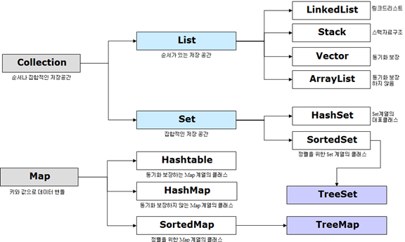
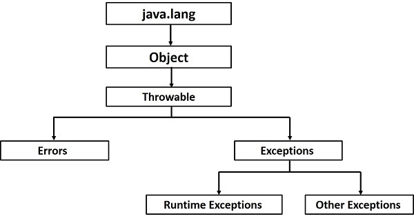

# 와일드카드(wild card)
## 정의
- 제네릭 타입을 사용할 때, 구체적인 타입을 명시하지 않고도 범용적으로 처리
- 하고 싶을 때 사용하는 기호는 `?`
```java
import java.util.ArrayList;
List<?> exampleList = new ArrayList<String>();
```
- 즉, `<?>`는 무슨 타입이든 가능하다는 의미이다. 

## 종류
1. 모든 타입 허용(unbounded wildcard) : 읽기 전용, 어떤 타입이든 받아야 할 때
2. T 또는 T의 서브 타입(upper bounded wildcard) : 읽기 전용, 제한된 타입에서 읽을 때
3. T 또는 T의 슈퍼 타입(lower bounded wildcard) : 쓰기 전용, 제한된 타입으로 넣을 때

--- 
# Collection
- 여러 객체를 모아놓은 것을 의미함.
- 데이터의 집합, 그룹을 의미함. 
- JCF(Java Collections Framework)는 이러한 데이터, 자료구조인 컬렉션과 이를 구현하는 클래스를 정의하는 인터페이스를 제공한다. 



| 인터페이스 | 구현클래스                             | 특징                                                                       |
|------------|-----------------------------------------|--------------------------------------------------------------------------|
| Set        | HashSet<br>TreeSet                      | 순서를 유지하지 않는 데이터의 집합으로 데이터의 중복을 허용하지 않는다.                                 |
| List       | LinkedList<br>Vector<br>ArrayList       | 순서가 있는 데이터의 집합으로 데이터의 중복을 허용한다.                                          |
| Queue      | LinkedList<br>PriorityQueue             | List와 유사                                                                 |
| Map        | Hashtable<br>HashMap<br>TreeMap         | 키(Key), 값(Value)의 쌍으로 이루어진 데이터의 집합으로, 순서는 유지되지 않으며 키(Key)의 중복은 허용하지 않으나 값(Value)의 중복은 허용한다.   |

1. `Set Interface` : 순서가 정해지지 않고 값의 중복을 허용하지 않는 데이터의 집합 
- HashSet 
- TreeSet
```java
public static void main(String[] args) {
    // Set 객체 생성
    Set<String> strSet1 = new HashSet<String>(); // HashSet은 Set을 Interface한다.
    List<String> strList1 = new ArrayList<String>();

   // Set에 element 삽입
   strSet1.add("java");
   strSet1.add("java");
   strSet1.add("java");
   strSet1.add("java");
   strSet1.add("python");
   strSet1.add("python");
   strSet1.add("python");
   strSet1.add("1");

   // Set의 출력
   System.out.println(strSet1);

   for(String s : strSet1) {
       System.out.println(s);
   }
   /*
            위 코드에서 알 수 있는 점은 배열과 달리,
            한계값을 출력하기 위해서 리스트명.size()를 사용해야 하는 것
            출력할 때도 리스트명.get(i)를 썼다는 점이다.

            배열의 경우에는 배열명.length과 배열명[i]를 사용한다.

            리스트와 배열의 사용이 어렵다면 향상된 for문을 사용하자.
   */

}
```
2. `List Interface` : 순서가 있으며 값의 중복을 허용하는 데이터의 집합
- LinkedList
- Vector
- ArrayList
```java
public static void main(String[] args) {
    // 비어있는 List 생성 방법
    List<String> strList1 = new ArrayList<>();
   // List에 element를 넣는 방법 -> 배열과 달리 method를 통해서 element를 넣어야 함.
   strList1.add("java");
   strList1.add("python");
   strList1.add("C#");
   strList1.add("JavaScript");
   strList1.add("Kotlin");

   // 출력
   System.out.println(strList1);

   // 특정 element의 포함 여부 -> contains() 메서드를 사용 -> return boolean
   String searchElem1 = "python";
   boolean contains1 = strList1.contains(searchElem1); // elem이란 표현은 element의 축약어로 자주 쓰임
   System.out.println(searchElem1 + "의 포함 여부 : " + contains1);

   String searchElem2 = "py";
   boolean contains2 = strList1.contains(searchElem2);
   System.out.println(searchElem2 + "의 포함 여부 : " + contains2);

   String email = "a@test.com";
   boolean contains3 = email.contains("@");
   System.out.println("@의 포함 여부 : " + contains3);
   // String의 경우, char들이 '순서대로' 나열된 것이기 때문에 char 하나가 포함된 것을 contains() 메소드를 통해 부분 검색이 가능하지만,
   // searchElem2의 경우(즉, List의 Element)는 '완전히' 일치하는지를 확인하기 때문에
   // "python"이 포함 여부는 true이며, "py" 포함 여부에 대해서는 false가 된다.

   // 특정 element의 삭제 -> remove() : return type은 true/false
   String removeElem1 = "Kotlin";
   boolean removed1 = strList1.remove(removeElem1);
   System.out.println(removeElem1 + "의 삭제 여부 : " + removed1);
   System.out.println(strList1);

   // List 정렬 -> 배열과 동일
   Collections.sort(strList1);
   System.out.println("정렬된 List : " + strList1);
   // 원본 배열을 바꾼다. (index가 바뀐다.)

   // 역순 정렬
   Collections.sort(strList1, Collections.reverseOrder());
   System.out.println("역순 정렬된 : " + strList1);

   //일반 for문
   for(int i = 0; i < strList1.size(); i++) {
      System.out.print(strList1.get(i) + " 언어 ");
   }
   System.out.println();
   // 향상된 for문
   for(String s : strList1) {
      System.out.print(s + " 언어 ");
   }
        /*
            위 코드에서 알 수 있는 점은 배열과 달리,
            한계값을 출력하기 위해서 리스트명.size()를 사용해야 하는 것
            출력할 때도 리스트명.get(i)를 썼다는 점이다.

            배열의 경우에는 배열명.length과 배열명[i]를 사용한다.

            리스트와 배열의 사용이 어렵다면 향상된 for문을 사용하자.
        */
}
```
3. `Map Interface` : 키(Key)와 값(Value)의 쌍으로 이루어진 데이터의 집합으로, 순서가 없고 키의 중복은 허용하나 값의 중복은 허용하지 않는다.
- HashTable
- HashMap
- TreeMap

```java
public static void main(String[] args) {
    Map<String, String> strMap1 = new HashMap<>();

    // Map에 Key-Vaule 쌍을 삽입. => .put(키, 값);
    strMap1.put("kor20250001", "김일");
    strMap1.put("kor20250002", "김이");
    strMap1.put("kor20250003", "김삼");
    strMap1.put("kor20250004", "김사");
    strMap1.put("kor20250005", "김오");

    // Map 출력
    System.out.println(strMap1);

    strMap1.put("kor20250005", "KimFive");
    System.out.println(strMap1);
    // Map의 특징 중 하나로, 하나의 Key는 하나의 value만 가능하다.
    // key값이 동일하다면, value값은 가장 최신에 넣은 것으로 덮어쓰기 된다.
   
   / 특정 key의 value 조희
   System.out.println(strMap1.get("kor20250002"));

   // Java : Map에서의 key-value pair를 entry라고 칭한다.

   // 특정 키의 값 수정 1 : .put(키)를 통해 덮어쓰기
   strMap1.put("kor20250001", "KimOne");
   System.out.println(strMap1.get("kor20250001"));

   // 특정 키의 값 수정 2 : .replace()
   strMap1.replace("kor20250002", "KimTwo");
   System.out.println(strMap1.get("kor20250002"));

   // 특정 키의 존재 여부 : containsKey() -> boolean
   boolean searchKeyFlay1 = strMap1.containsKey("kor20250006");
   System.out.println("kor20250006 존재 여부 : " + searchKeyFlay1);

   // 특정 값의 존재 여부 : containsValue() -> boolean
   boolean searchVaule1 = strMap1.containsValue("김삼");
   System.out.println("김삼 존재 여부 : " + searchVaule1);

   // Map의 엔트리로부터 Set을 생성
   Set<Map.Entry<String, String>> entrySet1 = new HashSet<>();     // 비어있는 Set 생성
   Set<Map.Entry<String, String>> entrySet2 = strMap1.entrySet();  // Map의 element를 Set에 삽입
   System.out.println(entrySet1);
   System.out.println(entrySet2);
   System.out.println(entrySet2.size());       // 5가 출력된다는 점에서, 'key=value값'이 하나의 element로 잡힌다는 것을 알 수 있다.

   List<Map.Entry<String, String>> entryList1 = new ArrayList<>();       // 가능함.
   // List<Map<String, String>> entryList2 = strMap1.entrySet();   // 불가능함. (Map->List 대입이 불가능하다.)

   // Map -> List로 형변환을 하고 싶다면, Set을 경유해야 한다.
   entryList1.addAll(entrySet2);
   System.out.println(entryList1);

   // Key만 추출하기
   Set<String> keySet = strMap1.keySet();
   System.out.println(keySet);

   // value만 추출하기
   // Set<String> valueSet = strMap1.values(); -> 오류 : 필요한 타입은 Set이지만, 제공된 타입은 Collection이기 때문.
   // 위와 같은 문제가 발생하는 이유는, key가 중복을 허용하지 않기 때문에 Set으로 형변환이 가능한 반면,
   // 복수의 key에서 동일한 value가 존재할 수 있기 때문에, Set으로 생성하는 것이 불가능하다.
   Collection<String> values = strMap1.values();
   System.out.println(values);
}
```

---
# JSON(JavaScript Object Notation)
- 본래 자바스크립트 언어로부터 파생되어 자바스크립트 구문을 따르지만, 언어 독립형 데이터 포맷. 
- JSON을 직역하자면 '자바 스크립트 개체 표현법'으로, 데이터를 쉽게 '교환'하고 '저장'하기 위한 텍스트 기반의 데이터 교환 표준이다. 
- 텍스트 기반이기 때문에 다양한 프로그래밍 언어에서 읽고 사용할 수 있다. 
- 프로그래밍 언어나 플랫폼에 독립적이기 때문에 구문은 분석 및 JSON 데이터 생성을 위한 코드는 Java / Python 등 다양한 언어에서 쉽게 이용 가능.

## JSON의 기본 형태
```dtd
{ key : value }
```
- JSON의 형태는 키(Key)와 값(Value)의 쌍으로 이루어져 있는 구조이다. 
- 그리고 key와 Value 사이에는 `콜론(:)`dl emfdjrkrp ehlsek. 
```dtd
{key1 : value, key2 : value2}
```
- 여러 데이터를 나열하는 경우, `쉼표(,)`를 사용한다. 
```dtd
{ key1 : { inKey : inValue }, key2 : [arr1, arr2 arr3] }
{"판매자정보" : { "이름" : "남도일", "지역" : "서울" } , "판매품목" : ['사과','배','딸기']  }
```
- 객체는 `중괄호({})`로 묶어서 표현하고, 배열은 `대괄호([])`로 묶어서 표현한다. 
```dtd
[   1,    "str",    true,    {inKey : "value"},    ["일", "이"],    null    ]

// 숫자 (number)
{  k  :  1  }

//문자열 (string)
{  k  :  "str"  }

//불리언(boolean)
{  k  :  true  }

//객체(object)
{  k  :  {inKey : "value" }  }

//배열(array)
{  k  :  ["일", "이"]  }

//널(NULL)
{  k  :  null  }
```

## 특징
1. 간결하고 가독성이 좋다. : 텍스트 기반 형식이므로 사람이 읽고 쓰기 쉬우며, 간단하고 가독성이 좋다.
2. 키-값 쌍 : 키(key)와 값(value) 사이의 쌍으로 데이터를 표현한다. 키-값 쌍은 객체의 형태로 표현되며, 중괄호{}로 둘러쌓여 있다.
3. 데이터 타입 지원 : 다양한 데이터 타입을 지원한다. 문자열, 숫자, 불리언, 배열, 객체, NULL 표현할 수 있다. 
4. 문자열은 이스케이프가 가능하다. : 문자열 내에서 특수 문자를 이스케이프하여 표현할 수 있다.
5. 중첩 구조 : JSON 객체 내에서 다른 JSON 객체를 중첩하여 사용할 수 있으며, 배열을 사용하여 여러 값을 저장할 수도 있다.
6. 언어 독립적 : 언어 독립적인 형식이므로 다양한 프로그래밍 언어 간에 데이터를 교환하는데 사용할 수 있다.
7. 웹 API 통신 : 웹 어플리케이션에서 서버와의 통신에 JSON을 주로 사용한다. 서버에서 클라이언트로 데이터를 보낼 때나 클라이언트에서 서버로 데이터를 전송할 때 주로 JSON 형식을 사용한다.
8. JSON.stringify와 JSON.parse 
    - JavaScript에서 JSON을 다룰 때 JSON.stringify 함수를 사용하여 JavaScript 객체를 JSON 문자열로 직렬화하고, JSON.parse 함수를 사용하여 JSON 문자열을 JavaScript 객체로 역직렬화한다.
9. JSON Schema : JSON 데이터의 유효성 검사 및 문서화를 위한 JSON Schema라는 표준이 있다.


```dtd
{
        "이름공간(key)": "값(value)",
        "값 구분자": "각각의 값들은 ','(콤마)로 구분되어야 합니다.",
        "이스케이프": "키가 값에서 큰따옴표를 쓰고 싶으면-특정 문자를 이스케이프 하려면- \" 처럼 문자 앞에 역슬래시를 붙입니다.",
        "자료형": "표현 가능한 자료형은 String, int, double, boolean, null, object, array 6개 입니다.",
        "문자열 값": "큰따옴표로 감싸서 표현됨 - 자바와 같음.",
        "숫자": 123456, // 큰따옴표 없이 표현됨
        "boolean 값": true,
        "null 값": null,
        "object 값": {
            "값1": 123456789,
            "값2": false,
            "값3": {
                "객체 내부": "객체 위치 가능",
                "구분자": "key-value 구분은 ':'(콜론)으로 이루어집니다."
            }
        },
        "Arrray 값": [
            "여기에 String을 넣고 싶다면 다시 ""를 써야합니다.",
            {
                "현재 값의 인덱스": 1,
                "해당 방식처럼": "배열 안에 여러 값을 넣는 것도 가능"
            },
            [ "배열", "내부에", "배열을", "삽입하는 것도", "가능합니다."]
        ],
        "JSON 예시": "마무리"
}
```

## GSON
- Google JSON의 약자로, Java에서 생성한 '객체'를 매개변수로 넣으면 GSON 객체를 생성하고 toString() 메소드를 사용한다.
- Map의 형태로 매칭시킨 데이터들을 JSON String으로 반환해주는 기능을 지닌 라이브러리이다.

### GSON 목적
JAVA 객체를 JSON 형태로 변환하거나 혹은 반대로 변환하는데 사용한다. 

### GSON 설치 
1. Chrom에서 mvn 검색한다.
2. maven repository로 들어간다.
3. GSON 검색 후 최신 버전을 선택한다. 
4. Maven에서 코드 복사 후, pom.xml에 붙여넣는다.

### GSON의 주요 Class
1. Gson : 변환을 위해 (JSON ↔ JAVA 객체) 주로 사용되는 클래스
2. GsonBuilder : GSON 인스턴스에 대한 사용자 정의 구성을 허용(prettyPrinting 등)
3. JsonObject : JSON '객체'를 나타냄. 

---

# 예외(Exception)
## 정의 
- 프로그램 실행 중에 발생하는 비정상적인 상황.
- 예외 역시 Pascal Case로 작성되었다는 점에서 예외 역시 일종의 class임을 알 수 있다. 

# 예외 처리(Exception Handling)
- 예외 처리는 코드 작성자가 예기치 않게 발생하는 에러들에 대응할 수 있도록 사전에 방지하는 것이다.
- 예외 처리를 하면 프로그램의 비정상적인 종료를 방지하여 정상적인 실행 상태를 유지할 수 있다. 
- 프로그램에서 에러가 발생하는 이유는 다양하지만 자주 발생하는 에러는 다음과 같다.
  - 사용자의 입력 실수
  - 네트워크 연결 끊김
  - 메모리 공간 부족
  - 개발자의 코드 실수
  - 유효하지 않은 파일 사용
  - 즉, 에러가 발생하는 원인은 크게 내부적인 요인과 외부적인 요인이 있다. 

## 예외 vs 에러
- 넓은 의미에서는 프로그램 실행 시 발생할 수 있는 모든 문제들을 에러라고도 부르기도 하지만, 에러와 예외는 엄밀히 말하면 차이가 있다.
- 특히 코드 실행 시 발생할 수 있는 문제들을 크게 에러와 예외로 구분하고 있다.

1. 에러(ERROR) : 한 번 발생하면 복구하기 어려운 수준의 심각한 문제를 의미하고, 대표적인 메모리 부족인 OutOfMemoryError와 StackOverflowError가 있다.
2. 예외(Exception) : 개발자의 잘못된 사용으로 인해 발생하는 에러는 상대적으로 약한 문제의 수준을 말한다. 즉, 개발자의 실수로 인해 발생하는 것이다. 이는 코드 수정을 통해 수숩이 가능한 문제이다. 

## 예외 처리의 필요성
- Java 특성 상 예외가 하나라도 발생하면 전체 컴파일링이 실패함.
- 사용자에게 새빨간 에러 메세지가 뜸.
- 컴파일링 시 데이터 누락이 발생할 수 있음.
- 예외 처리를 올바르게 했을 때 에외 상황에 대한 적절한 대응(사용자에게 알림 / 로그 기록)을 할 수 있다.

```java
int a = 10;
int b = 0;
int result = a / b;
// 분모가 0인데 나누려고 하기 때문에 예외가 발생. 
System.out.println(result); // 오류
```
```dtd
Exception in thread "main" java.lang.ArithmeticException: / by zero
        at ch22_exception.Exception01.main(Exception01.java:15)
```

## Java에서의 예외 처리 구문
```java
public static void main(String[] args) {
   try{
       // 예외가 발생할 수 있는 코드 
   } catch (Exception name) {
       // 예외 발생 시 처리할 코드
   } finally {
       // 예외 발생 여부와 관계없이 무조건 실행되는 코드
   }
}
```

```java
public static void main(String[] args) {
   int a = 10;
   int b = 0;
   try {
       int result = a / b;
      System.out.println("결과 : " + result);
   } catch (ArithmeticException e) {
      System.out.println("0으로 나눌 수 없습니다.");
   } finally {
      System.out.println("프로그램 정상 종료");
   }
}
```

## 예외 클래스의 상속 계층도
- Java에서 예외가 발생하면, 예외 클래스로부터 객체를 생성하여 해당 인스턴스를 통해 예외처리를 한다.
- 자바의 모든 에러와 예외 클래스는 Throwable 클래스로부터 확장되며, 모든 예외(Exception)의 상위 클래스는 Exception 클래스이다. 

- 또한 Exception 클래스는 실행 예외 클래스(RunTime Exception)와 일반 예외 클래스(Other Exception)로 구분된다. 

### 일반 예외 클래스(Exception)
- 런타임 시 발생하는 에러를 제외한 모든 Exception 클래스와 하위 클래스를 가리킨다.
- 컴파일러가 코드 실행 전에 예외 처리 코드 여부를 검사하기 때문에 Checked 예외라고도 부른다.
- 주로 잘못된 클래스명(ClassNotFoundException)이나 데이터형식(DataFormatException) 등 사용자의 편의 실수로 발생하는 경우가 많다.

### 실행 예외 클래스(Runtime Exception)
- 런타임 시 발생하는 RuntimeException클래스와 하위 클래스를 가리킨다.
- 컴파일러가 예외 처리 코드 여부를 검사하지 않기 때문에 Unchecked 예외라고도 부르기도 한다.
- 클래스 간의 형 변환 오류(ClassCastException), 배열의 범위를 벗어난 오류(ArrayIndexOutOfBoundsException), 값이 null인 참조 변수를 사용했을 때 발생하는 오류(NullPointerException) 등이 있다.

## 예외 처리 시 주의할 점
- catch 문은 if문과 비슷하게 순차적으로 검사를 진행하지만, 상위 catch 블록에서 예외 처리를 하게되면 하위에 존재하는 catch문은 실행되지 않는다.
- 따라서 여러개의 catch 블록을 작성할 경우, 예외 클래스의 하위 클래스를 먼저 배치하여 구체적인 예외처리를 먼저 검사하도록 작성하는 것이 좋다. 

## 예외 전가
- try-catch문 외의 예외를 호출한 곳으로 다시 떠넘기는 것을 말한다. 
- 메소드 선언부 끝에 throws 키워드를 작성하여 발생할 수 있는 예외들을 쉼표로 구분하여 나열하는 것으로 작성한다.
```java
void methodEx() throws NullPointerException, ArrayIndexOutOfBoundsException, ... {

}
```

```java
// 사용자 정의 예외
class LoginFailedException extends Exception {
    public LoginFailedException(String message) {
        super(message);
        System.out.println("예외가 발생했습니다.");
    }
}

public class Exception02 {
   public static void login(String id, String password) throws LoginFailedException {
       // 지역 변수
       String correctId = "admin";
       String corredtPassword = "1q2w3e4r";

       if(!id.equals(correctId) || !password.equals(corredtPassword)) {
           throw new LoginFailedException("ID 또는 Password가 틀렸습니다.");
       }
   }

    public static void main(String[] args) {
        String inputId = "admin";
        String inputPassword = "1234qwer";
        
        try {
            login(inputId, inputPassword);
        } catch (LoginFailedException e) {
            System.out.println("로그인 실패 : " + e.getMessage());
        } finally {
            System.out.println("프로그램 정상 종료");
        }
    }
}
```
