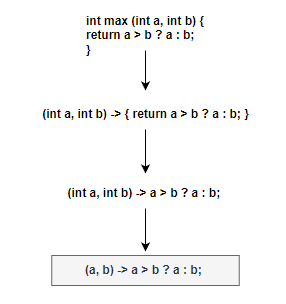
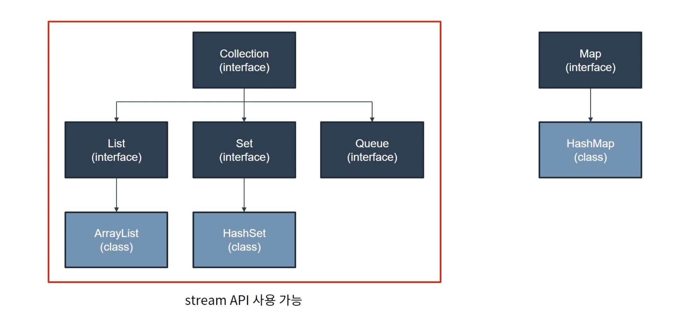

# 람다식(Lambda Expresstion)
- Java 8에서 도입된 '함수형 프로그래밍(Functional Programming)'을 지원하기 위한 표현식에 해당한다. 
- 현재 사용되고 있는 람다의 근간은 수학의 기초 컴퓨터과학 분야에서의 람다 대수이며, 람다 대수는 간단히 말하자면 수학에서 사용하는 함수를 보다 단순하게 표현하는 방식을 말한다. 
- 람다 함수는 프로그래밍 언어에서 사용되는 개념으로 익명 함수(Anonymous functions)라고도 한다. 
- 람다식이란 쉽게 말해 '하나의 식'으로 표현한 것이다. 하나의 식으로 표현하여 훨씬 간략하게 표현이 가능하게 되며, 메소드의 이름과 바환값이 없어지므로 "익명 함수"라고 한다.
  

- 형식은 아래와 같다. 

```dtd
(매개변수) -> { 실행문 }
```

| 메서드 | 람다식 |
|--------|--------|
| ```java<br>void printVal(String name, int i) {<br>    System.out.println(name + "=" + i);<br>}``` | ```java<br>(name, i) -> System.out.println(name + "=" + i)``` |
| ```java<br>int square(int x) {<br>    return x * x;<br>}``` | ```java<br>x -> x * x``` |
| ```java<br>int roll() {<br>    return (int) (Math.random() * 6);<br>}``` | ```java<br>() -> { return (int) (Math.random() * 6); }``` |
| ```java<br>int sumArr(int[] arr) {<br>    int sum = 0;<br>    for (int i : arr) {<br>        sum += i;<br>    }<br>    return sum;<br>}``` | ```java<br>(int[] arr) -> {<br>    int sum = 0;<br>    for (int i : arr) {<br>        sum += i;<br>    }<br>    return sum;<br>}``` |


```java
public static void main(String[] args) {
    int[] arr = new int[5];
    Arrays.setAll(arr, (i) -> (int) (Math.random() * 5) + 1);

// (i) - (int) (Math.random() * 5) + 1 람다식을 메서드로 표현
    int method() {
        return (int) (Math.random() * 5) + 1;
    };
}
```
- 람다식으로 메소드를 변수처럼 다루는 것이 가능한 것이다.

```java
public static void main(String[] args) {
    // 기존의 익명 클래스 방식
    Runnable runnable = new Runnable() {
                @Override
                public void run() {
                    System.out.println("Hello, Java!");
                }
            };
            
    // 위 방식으로 익명 클래스를 정의한 후, 
    // 메소드를 호출한다.
    runnable.run();
    
    // Lambda 방식
    Runnable runnableLambda = () -> System.out.println("Hello, Java!");
    // 위 코드가 익명 클래스에서 메소드를 오버라이딩해서 재정의하는 부분까지 한 것. 
    // 메소드 호출 가능 
    runnableLambda.run();
    
}
```

## 람다식이 등장한 배경
- 람다식이 나오기 전에는 Java에서 함수형 프로그래밍을 하기 위해 익명 클래스를 주로 사용하였다.
- 하지만, 위 방법은 코드 에제에서 볼 수 있듯이 코드가 길어지고 불필요한 반복이 많아지며, 가독성이 떨어지는 문자가 생긴다.

```java
import java.util.Comparator;

public static void main(String[] args) {
    Comparator<Integer> comparator = new Comparator<Integer>() {
        @Override
        public int compare(Integer o1, Integer o2) {
            return o1.compareTo(o2);
        }
    }; // 결국은 Comparator 인터페이스의 인스턴스를 생성한 것이므로, ; 를 필수적으로 써줘야 한다. 
    
    // Lambda 
    Comparator<Integer> comparatorLambda = (o1, o2) -> o1.compareTo(o2);
}
```

## 람다식의 장점
1. 코드의 간결성 : 람다를 사용하면 불필요한 반복문의 삭제가 가능하며, 복잡한 식을 단순하게 표현할 수 있다.
2. 표현력 향상 : 익명 클래스를 짧은 표현으로 대체
3. 지연 연산 수행 : 람다는 지연 연상을 수행함으로써 불필요한 연산을 최소화 할 수 있다.
4. 병렬 처리 가능 : 멀티 스레드를 활용하여 병렬 처리를 사용할 수 있다.

## 람다식의 단점
1. 디버깅의 어려움 : 람다식 내부에서 발생하는 오류의 디버깅이 어렵다.
2. 재사용성이 낮음. : 익명 클래스에 '비해' 재사용이 어렵다.
3. 복잡한 로직 표현에 부적합 : 단순 로직의 경우 람다식 사용 가능하지만, 아닌 경우는 익명 클래스를 사용한다. 
4. 람다식의 호출이 까다롭다. 
5. 람다 stream 사용 시, 단순 for문 또는 while문 사용 시 성능이 떨어진다.
6. 불필요하게 너무 사용하게 되면 오히려 가독성을 해칠 수 있다. 

## 람다식 문법 
람다식 구조는 크게 3가지로 나뉜다.
1. 매개변수 목록
2. 화살표(->)
3. 구현부 

```java
public static void main(String[] args) {
    // 1. 매개변수와 실행문이 하나일 때, 중괄호 생략이 가능하다.
    (int x, int y) -> x + y
            
    // 2. 매개 변수가 하나 일 때, 소괄호 생략이 가능
    str -> System.out.println(str)
            
    // 3. 실행문이 여러 줄일 때는, 중괄호가 필수 이다. 
    (x, y) -> {
        int sum = x + y;
        return sum;
    }
}
```

---
# 함수형 인터페이스(Functional Interface)
- 람다식은 단일 메소드만 가지는 인터페이스(함수형 인터페이스)를 구현하는 형태로 사용된다.
- `@FunctionalInterface` 애너테이션을 사용하면 컴파일 시에 단일 메서드인지 확인한다.
- 그래서 '사용자 정의 함수형 인터페이스'를 작성할 때, 클래스 레벨에 `@FunctionalInterface`를 명시해야 한다. 

```java
@FunctionalInterface
interface MyFunction {
    void start();
}

public static void main(String[] args) {
    MyFunction myFunction1 = () -> System.out.println("정의한 함수를 실행합니다.");
    // 위와 같이 매개변수가 없는 경우는 ()로 표현한다.
    
    myFunction1.start(); // 결과값 : 정의한 함수를 실행합니다. 
}
```

1. java.util.function 패키지의 기본적인 주요 함수형 인터페이스

| 함수형 인터페이스      | 메서드         | 반환타입  | 설명                                                                 |
|------------------------|----------------|-----------|----------------------------------------------------------------------|
| java.lang.Runnable     | run()          | void      | 매개변수도 없고, 반환 값도 없다.                                    |
| Supplier<T>            | get()          | T         | 매개변수는 없고 반환 값만 있다.                                     |
| Consumer<T>            | accept(T t)    | void      | Supplier와 반대로 매개변수만 있고, 반환 값이 없다.                 |
| Function<T, R>         | apply(T t)     | R         | 일반적인 함수로, 하나의 매개변수를 받아서 결과를 반환한다.         |
| Predicate<T>           | test(T t)      | boolean   | 조건식을 표현하는 데 사용되며 매개변수는 하나, 반환 타입은 boolean이다. |

a. Runnable
- 매개변수도 없고 반환값도 없는 단순 실행을 위한 인터페이스
- 사용 : 스레드 실행 시, 비동기 작업 실행 시

b. Supplier<T>
- 매개변수 없이 값을 반환하는 인터페이스, 단순히 값을 `공급`하는 역할.
- 사용 : 객체 생성, 지연 로딩

c. Consumer<T>
- 값을 매개변수로 받아서 사용하고, 아무것도 반환하지 않는 인터페이스, 데이터를 `소비`하는 역할
- 사용 : 데이터 처리, 로깅, 이벤트 헨들러

d. Function<T, R>
- `하나의 매개변수`를 받아서, 연산을 수행한 후 결과를 리턴한다.
  - T는 입력타입, R은 리턴 타입을 명시함.
- 사용 : 데이터 반환, 매핑처리, 컬렉션(Collection) 조작

e. Predicate<T>
- `하나의 매개변수`를 받아서 특정 조건을 검사한 후, true / false를 반환한다.
- 사용 : 필터링, 조건 검사, 유효성 검사.

f. 함수형 인터페이스 조합 
- Java 8에서는 함수형 인터페이스끼리의 조합도 가능하다.
```java
import java.util.function.Predicate;

public static void main(String[] args) {
  // 메소드 1
  Predicate<String> startsWithA = (str) -> str.startsWith("A");
  // 메소드 2
  Predicate<String> endWithX = (str) -> str.endsWith("x");
  
  // and()로 두 조건 결합 
  Predicate<String> startsWithAAndEndWithX = startsWithA.and(endWithX);

  System.out.println(startsWithAAndEndWithX.test("Alex")); // True
}
```

2. 매개변수가 두 개인 함수형 인터페이스 : 이름 앞에 접두사 "Bi"가 붙는다.

| 함수형 인터페이스          | 메서드              | 반환타입 | 설명                                                                 |
|----------------------------|---------------------|----------|----------------------------------------------------------------------|
| BiConsumer<T, U>           | accept(T t, U u)    | void     | 두 개의 매개변수만 있고, 반환 값이 없다.                             |
| BiFunction<T, U, R>        | apply(T t, U u)     | R        | 두 개의 매개변수를 받아서 하나의 결과를 반환한다.                   |
| BiPredicate<T, U>          | test(T t, U u)      | boolean  | 조건식을 표현하는 데 사용되며 매개변수는 둘, 반환 타입은 boolean.   |

3. UnaryOperator와 BinaryOperator : Function의 변형으로 매개변수의 타입과 반환타입이 모두 일치한다. 

| 함수형 인터페이스      | 메서드           | 반환타입 | 설명                                                                 |
|------------------------|------------------|----------|----------------------------------------------------------------------|
| UnaryOperator<T>       | apply(T t)       | T        | Function의 자손<br>Function과 달리 매개변수와 결과의 타입이 같다.    |
| BinaryOperator<T>      | apply(T t, T t)  | T        | BiFunction의 자손<br>BiFunction과 달리 매개변수와 결과의 타입이 같다.|

4. Collection Framework Interface와 함수형 인터페이스 

| 인터페이스      | 메서드                                             | 반환타입  | 설명                                   |
|------------|----------------------------------------------------|-----------|----------------------------------------|
| Collection | removeIf(Predicate<E> filter)                     | boolean   | 조건에 맞는 요소를 삭제                |
| List       | replaceAll(UnaryOperator<E> operator)             | void      | 모든 요소를 변환하여 대체              |
| Iterable   | forEach(Consumer<T> action)                       | void      | 모든 요소에 작업 action을 수행         |
| Map        | compute(K key, BiFunction<K,V,V> f)              | V         | 지정된 키의 값에 작업 f 수행           |
| Map        | computeIfAbsent(K key, Function<K,V> f)          | V         | 키가 없으면, 작업 f 수행 후 추가       |
| Map        | computeIfPresent(K key, BiFunction<K,V,V> f)     | V         | 모든 요소에 병합작업 f를 수행          |
| Map        | forEach(BiConsumer<K,V> action)                  | void      | 모든 요소에 작업 action을 수행         |
| Map        | replaceAll(BiFunction<K,V,V> f)                  | void      | 모든 요소에 치환작업 f를 수행          |

---

# Stream API
- Java 8에서 도입되었으나, 컬렉션(List, Set 등)과 배열에 저장된 데이터를 선언형(Declarative)으로 처리하기 위한 추상화된 반복(Iteration) 프레임워크
- 데이터 소스로부터 파이프라인 형태로 여러 연산(필터링 / 매핑 / 정렬 / 집경 등)을 연결해 수행하며, 내부적으로 병렬 처리도 간단한 수준이라면 지원한다.
- `Stream API`는 그 자체로는 객체지향적인 코드와 크게 연관성이 없으나, API를 활용한 코드는 객체지향적인 코드를 함께 사용되었을 때 가독성을 크게 향상 시켜준다.
- Stream API는 `Collection 인터페이스` 내부에 존재하는 메소드들이다. 컬렉션 인터페이스를 구현하는 다른 구현체들에서 사용할 수 있다. 



- 그림에서 볼 수 있듯, `Map`은 `Collection 인터페이스`를 상속받지 않으므로, Map에서는 Stream API를 사용할 수 없다.
- 주로 많이 사용되는 메소드는 `forEach()`, `filter()`, `map()`, `count()`이다.
- 컬렉션 인터페이스를 상속 받은 List, Set, Queue는 Stream API를 사용할 수 있고, 당연히 해당 인터페이스들을 구현하고 있는 구현체들에서도 사용 가능하다.

- filter() 사용 예시 
  - Collection 자료형의 특징 element만 추출할 때 사용하는 메소드로, 람다식을 사용하면 편리하다.
```java
public static void main(String[] args) {
    List<String> names = Arrays.asList("김영", "김일", "김이", "김삼", "김사");

    // filter()
    List<String> namesWithKim = names.stream()
            .filter(name -> name.startsWith("김"))
            .toList();
}
```
- map() 사용 예시 
  - Java의 Collection의 Map이 아님. 
  - Python의 Map과 유사한 형태로, Collection 내부 element들에게 각각 함수 / 메소드에 적용하는 형태
  - 아래 예시를 통해 .map(String::toUpperCase)의 해석은 englishNames 리스트에서 a로 시작한 것만 걸러낸 결과값인 리스트의 각 요소(`["alice", "anya"]`)에 toUpperCase를 적용한 것이다. 
  - 따라서 결과값은 '`["ALICE", "ANYA"]`가 된다.
```java
public static void main(String[] args) {
  List<String> englishNames = Arrays.asList("alice", "anya", "bacon", "camel", "pascal", "yor", "spy", "family");
  List<String> result = englishNames.stream()
          .filter(name -> name.startsWith("a")) // 'a'로 시작하는 element만 추출
          .map(String::toUpperCase)                   // 그런 다음 대문자로 변환
          .sorted()                                   // 정렬
          .toList();                                  // List로 자료 변형
}
```
- count() 사용 예시 
```java
public static void main(String[] args) {
  // count()
  int count = englishNames.size();
  System.out.println(count);

  long count2 = englishNames.stream()
          .filter(name -> name.length() > 3)
          .count();
  System.out.println(count2);
}
```
- forEach() 사용 예시 
```java
public static void main(String[] args) {
        // List 생성 (선언과 초기화 동시)
        List<String> fruits = Arrays.asList("사과", "바나나", "딸기");

        // forEach 예제
        fruits.forEach(fruit -> System.out.println("과일 : " + fruit));

        System.out.println();

        List<Integer> numbers = Arrays.asList(1, 2, 3, 4, 5);
        numbers.forEach(number -> System.out.println("리스트 요소의 두배 값 : " + (number * 2)));
        System.out.println();
        numbers.forEach(number -> System.out.print(number * 2 + " "));
    }
```

## Stream API의 사용이유
1. 간결성
  - 전통적인 for / while 반복문 대신 파이프라인 메소드 체이닝으로 가독성 향상
2. 표현력
   - "무엇을 처리할 것인가"를 '선언적으로 기술'하고, "어떻게 반복할 것인가"는 API에게 맡기면 된다. 
3. 병렬처리 
   - 성능 향상을 위한 방법 중 하나로 손쉽게 병렬 연산을 수행해 성능 최적화 가능
4. 함수형 프로그래밍
   - 람다식, 함수형 인터페이스와 결합해 고차 함수 스타일 설계 기능

---

참고 자료1 : https://hstory0208.tistory.com/entry/Java%EC%9E%90%EB%B0%94-%EB%9E%8C%EB%8B%A4%EC%8B%9DLambda%EC%9D%B4%EB%9E%80-%EA%B7%B8%EB%A6%AC%EA%B3%A0-%EC%82%AC%EC%9A%A9%EB%B2%95

참고 자료2 : https://velog.io/@edgar6bf/Java-Stream-API
